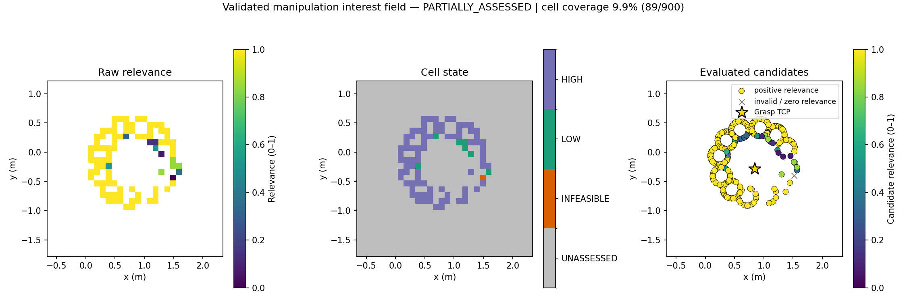
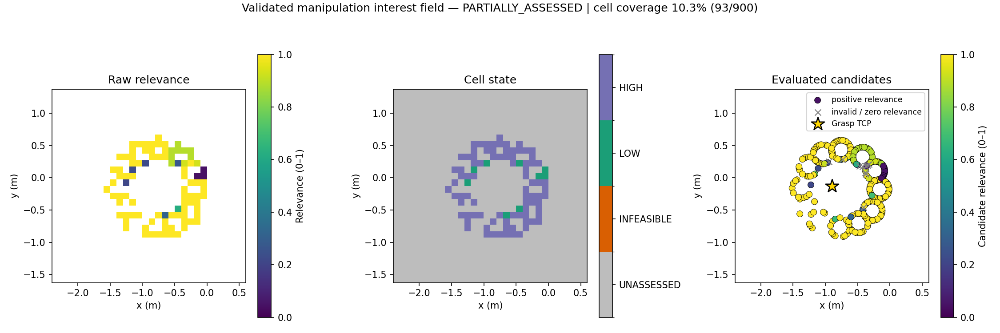
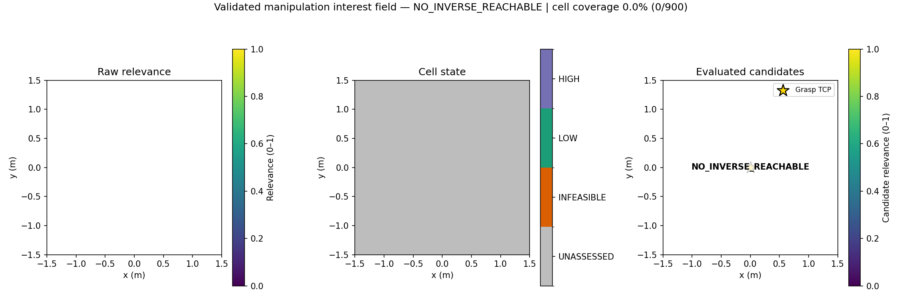

# A1 — Validated Manipulation Interest Field

A6 状态：14/14 pilot slots 已完成（另保留 1 次启动期 INVALID 及同 slot 重跑），
停在 [pilot review checkpoint：完整结果、失败分布与设计限制](docs/A6_PILOT_RESULTS.md)。
Pilot-1 永久保留为 v1 protocol/debugging results，未启动 formal matrix，A6 分支未合并 main。
已批准的独立修订见 [A3/A5 v1.1 object-aware operational gating](docs/OBJECT_AWARE_GATING_V11.md)：
显式启用、默认仍为 v1；A1/A2/A4、RM4D 和执行参数不变。当前只做单元、Hard 记录回放与原 A5 自然场景回归，不运行 Pilot-2。

项目进度：本页保留冻结 A1 的阶段说明。A5 已完成一次自然 Gazebo 闭环，
详见 [A5 实现、运行说明与实际 grasp/lift 结果](docs/A5_SIM_ACTIVE_PERCEPTION.md)
及 [独立 task-domain RM4D asset](docs/A5_TASK_DOMAIN_ASSET.md)。A1–A4 方法保持不变。

本仓库实现 Paper 1 的最小 A1 原型：把 `map` 下的 Brick grasp TCP 交给冻结的 AUBO RM4D planner，并将 planner **实际验证过的候选**投影成 0.10 m 二维地面场。这里的

\[
q=(x,y)
\]

是 `map` 中 BUNKER `base_link` 的地面位置。该结果称为 **Validated Manipulation Interest Field (VMIF)**；它是 grasp-specific、budget-limited 的部分评估结果，不是完整 RM4D capability map。

冻结依赖为 `rm4d-aubo-baseline-v1 @ e9d431299053f38a4a4319aed3dfeccc261b9fac`，本仓库不修改该 baseline。

## 方法定义

对冻结 planner 返回的 `evaluated_candidates` 记为 `E`。在当前 baseline 中，

\[
|E| \leq \texttt{validation\_limit}=256.
\]

候选 `i` 的 validity gate 为

\[
g_i = \mathbf{1}\left[
\texttt{valid}
\land \texttt{rm4d\_reachable}
\land \texttt{ik\_valid}
\land \texttt{collision\_free}
\land \neg\texttt{footprint\_collision}
\land m_i \geq 0.01\ \mathrm{rad}
\right],
\]

其中 `m_i` 是 `joint_margin_rad`。连续候选 relevance 只由 joint-limit margin 决定：

\[
v_i =
\begin{cases}
\operatorname{clip}(m_i / 0.5, 0, 1), & g_i=1,\\
0, & g_i=0.
\end{cases}
\]

`fk_position_residual_m` 和 `fk_orientation_residual_rad` 仅保留作数值诊断；通过 baseline acceptance 后，它们不参与 `v_i`。冻结 planner 的 `final_score` 也不参与 VMIF。

默认网格为以 grasp XY 为中心的 3 m × 3 m 网格，分辨率 `Delta=0.10 m`，共 30 × 30 个 cell。数组为 row-major `[y, x]`。cell `C_{r,c}` 使用半开边界：

\[
C_{r,c}=[x_0+c\Delta,x_0+(c+1)\Delta)
\times[y_0+r\Delta,y_0+(r+1)\Delta).
\]

令 `E_{r,c}` 为 `E` 中落入该 cell 的候选（包括不同 yaw）。不做插值或 smoothing：

\[
R_{r,c}=
\begin{cases}
\mathrm{NaN}, & E_{r,c}=\varnothing,\\
\max_{i\in E_{r,c}} v_i, & \exists i\in E_{r,c}: g_i=1,\\
0, & \text{otherwise}.
\end{cases}
\]

每个 cell 的语义为：

- `UNASSESSED = -1`：没有实际验证候选落入；不能解释为 unreachable 或 infeasible。
- `INFEASIBLE = 0`：cell 被评估，但其中没有候选通过完整 gate。
- `LOW = 1`：`0 < R < 0.8`。
- `HIGH = 2`：`R >= 0.8`。

若 `summary.inverse_reachable == 0`，field-level status 为 `NO_INVERSE_REACHABLE`，900 个 cell 全部保持 `UNASSESSED`，relevance 全部为 `NaN`。否则状态为 `PARTIALLY_ASSESSED`。

### Assessment coverage

VMIF 明确保留 `inverse_reachable`、`deduplicated`、`validation_limit`、`evaluated`、`valid`、`rejected_by_reason`、assessed cell 数量和覆盖比例。尤其当 `deduplicated > evaluated` 时，只能描述这 256 个被验证候选所覆盖的空间；其余 cell 不得由缺失证据推断为不可达。

## 使用的 RM4D 信息

使用 result 的 `schema_version`、`frame_id`、`grasp_id`，以及 summary 中上述 coverage 计数。对每个 `evaluated_candidate` 使用：

- `bunker_x`、`bunker_y`、`bunker_yaw`；
- `rm4d_reachable`、`ik_valid`、`collision_free`、`footprint_collision`、`valid`；
- `joint_margin_rad`；
- 仅供诊断的 FK position/orientation residual 和 `rejection_reason`。

不使用返回的 top-K `candidates` 集合，也不使用 baseline `final_score`。调用时传 `top_k=1` 只缩小 top-candidate 输出；场构建仍消费完整 `evaluated_candidates`。

## API 与数据结构

ROS-independent 公共接口位于 `reachability_guided_aerial_perception`：

- `GraspTCP`：只接受已解析到 `map` 的 grasp ID、position 和 unit quaternion。
- `GridSpec`、`FieldConfig`：网格几何及 margin/分类阈值。
- `FieldStatus`、`CellState`、`AssessmentCoverage`。
- `ManipulationInterestField`：`relevance`、cell state、每 cell evaluated/feasible count、代表性 best yaw/margin 和 residual diagnostics。
- `candidate_relevance(...)`、`build_field_from_result(...)`：纯数据评分和 rasterization。
- `build_field(...)`：对一个 grasp 调用一次冻结 `BasePlacementAPI.plan(..., top_k=1)`。
- `field_summary(...)`、`save_field_bundle(...)`、`render_field(...)`。
- `to_occupancy_grid_payload(...)`：RViz/ROS adapter seam；返回与 `nav_msgs/OccupancyGrid` 核心布局一致的普通字典，含 `header.frame_id`、origin、resolution、width、height、row-major `data` 和额外 `field_status`。`data` 中 `-1` 为 unassessed、`0` 为 assessed infeasible、`1..100` 为 feasible relevance。此处不依赖或发布 ROS message。

每个输出目录只包含：

- `field.npz`：`relevance`、`state`、`evaluated_count`、`valid_count` 栅格及必要的 grasp/frame/status/grid metadata；
- `summary.json`：方法语义、阈值、网格、coverage 和 cell state 计数；
- `candidate_diagnostics.csv`：全部实际验证候选的 pose、gate、margin、residual、field score 和 rejection reason；
- `field.png`：无 smoothing 的三联图（raw field、categorical state、candidate scatter）。

## Quick start

项目要求 Python 3.10。若只安装本包，可使用：

```bash
python3.10 -m venv .venv
.venv/bin/python -m pip install -e .
```

真实 RM4D 调用还需要冻结仓库自带的 Python 环境和本地 10M map。下面命令使用一份长生命周期 `BasePlacementAPI` 依次运行三个离线场景，每个场景只调用一次 planner：

```bash
mkdir -p /tmp/rgap-mpl-cache
MPLCONFIGDIR=/tmp/rgap-mpl-cache \
PYTHONPATH=src \
/media/lu/P450_PAPER/RM4D_AUBO/conda-env/bin/python \
  scripts/run_offline_validation.py \
  --rm4d-root /media/lu/P450_PAPER/RM4D_AUBO \
  --rm4d-config /media/lu/P450_PAPER/RM4D_AUBO/configs/mr4_offline_base_placement.json \
  --rm4d-map /media/lu/P450_PAPER/RM4D_AUBO/runs/formal-10m/data/rm4d_aubo_i5_joint_42/10000000/rmap.npy \
  --output-root outputs/a1
```

`configs/rm4d_aubo_baseline_v1.json` 是 release manifest；其中 `frozen_artifacts.planner_config_path` 指向上面传给 `BasePlacementAPI.from_files(...)` 的 runtime planner config。它本身不是 `--rm4d-config` 输入。

单 grasp CLI 为：

```bash
MPLCONFIGDIR=/tmp/rgap-mpl-cache \
PYTHONPATH=src \
/media/lu/P450_PAPER/RM4D_AUBO/conda-env/bin/python \
  -m reachability_guided_aerial_perception.cli \
  --rm4d-root /media/lu/P450_PAPER/RM4D_AUBO \
  --rm4d-config /media/lu/P450_PAPER/RM4D_AUBO/configs/mr4_offline_base_placement.json \
  --rm4d-map /media/lu/P450_PAPER/RM4D_AUBO/runs/formal-10m/data/rm4d_aubo_i5_joint_42/10000000/rmap.npy \
  --grasp examples/scenarios/nominal.json \
  --output-dir outputs/one_grasp
```

将绝对路径替换为另一台机器上同一冻结仓库、planner config 和 map 的明确路径即可。

## 三个离线场景的实测结果

以下是对冻结 map 的一次三场景运行，不是 benchmark。candidate coverage 为 `evaluated / deduplicated`，cell coverage 为 `assessed / 900`。

| Scenario | Field status | Inverse / dedup / evaluated / valid | UNASSESSED / INFEASIBLE / LOW / HIGH | max R | Candidate coverage | Cell coverage | Artifacts |
|---|---|---|---|---:|---:|---:|---|
| nominal | `PARTIALLY_ASSESSED` | 30564 / 30295 / 256 / 254 | 811 / 1 / 7 / 81 | 1.0 | 0.8450% | 9.8889% (89/900) | [图](outputs/a1/nominal/field.png) · [summary](outputs/a1/nominal/summary.json) · [CSV](outputs/a1/nominal/candidate_diagnostics.csv) · [NPZ](outputs/a1/nominal/field.npz) |
| boundary | `PARTIALLY_ASSESSED` | 35820 / 33544 / 256 / 246 | 807 / 0 / 9 / 84 | 1.0 | 0.7632% | 10.3333% (93/900) | [图](outputs/a1/boundary/field.png) · [summary](outputs/a1/boundary/summary.json) · [CSV](outputs/a1/boundary/candidate_diagnostics.csv) · [NPZ](outputs/a1/boundary/field.npz) |
| no_inverse | `NO_INVERSE_REACHABLE` | 0 / 0 / 0 / 0 | 900 / 0 / 0 / 0 | — | 0% | 0% (0/900) | [图](outputs/a1/no_inverse/field.png) · [summary](outputs/a1/no_inverse/summary.json) · [CSV](outputs/a1/no_inverse/candidate_diagnostics.csv) · [NPZ](outputs/a1/no_inverse/field.npz) |

nominal 与 boundary 的已评估 cell 都呈围绕 grasp 的稀疏环状/弧状分布，这与从不同 BUNKER base pose 和 yaw 到达同一 TCP 的移动操作几何一致；不同姿态造成了不对称的低 margin 区域。nominal 中观察到 1 个 assessed-infeasible cell；boundary 虽有 10 个 invalid candidate，但每个含 invalid candidate 的已评估 cell 也至少有一个通过 gate 的候选，因此没有 `INFEASIBLE` cell。离散 cell 和候选点在图中原样保留，没有连续化。no_inverse 图为空白/灰色并显式标注 field status，未将无候选扩散成不可达区域。







## 与 top-K candidates 的区别

top-K 只给少量经过 baseline 综合排序的离散落脚方案，并混合 IK quality、joint margin 和 travel 等 ranking 项。VMIF 不重新排序 top-K，而是对全部实际验证候选按地面 cell 与 yaw 聚合，只用 joint margin 形成 manipulation relevance；同时保留 assessed-infeasible 与 `UNASSESSED` 的区别。因此它能表达局部空间结构和备选 yaw，但仍严格受 256-candidate validation budget 限制，不能声称覆盖了所有 inverse-reachable candidates。

## 后续 MID360 融合边界（仅设计）

令 MID360 在环境位置 `x` 上维护

\[
B(x)=(p_{\mathrm{free}}(x),p_{\mathrm{occupied}}(x),p_{\mathrm{unknown}}(x)),
\quad \sum p(x)=1.
\]

对已验证可行的 cell/yaw `(c, psi)`，把 BUNKER footprint 变换到 `map`。一个最小的 task-relevant uncertainty 定义可以是

\[
U_{\mathrm{task}}(x)=p_{\mathrm{unknown}}(x)
\max_{(c,\psi):\;x\in\mathrm{Footprint}(c,\psi)}R(c),
\]

其中最大值只取 validated feasible representatives；没有覆盖时取 0。`p_occupied` 应在将来作为实际部署的 operational-feasibility gate，而不是回写或篡改 RM4D relevance。RM4D manipulation field 与 environmental belief 在融合前保持为两个独立量。

当前 cell-level field 只保存一个最高 relevance 的代表 yaw；`candidate_diagnostics.csv` 保留所有实际验证 yaw，可供后续 footprint-aware fusion 使用。本阶段未实现该融合。

## 限制与范围

- 输入 grasp 必须已解析到 `map`。冻结 API 只把 `map` 当作 baseline `world` 的数值 identity alias；若 `T_map_world` 非 identity，调用方必须先完成变换，本仓库不订阅 TF。
- field 只对应一个 grasp 和有限验证预算；网格外候选不参与栅格聚合，`UNASSESSED` 不代表不可达。
- 未输入 MID360 `Free / Occupied / Unknown`，也未实现环境不确定性、uncertainty-aware RM4D、active mapping、NBV、information gain、RL 或 World Model。
- 未实现 smoothing、插值、benchmark 或额外 safety/evidence framework。
