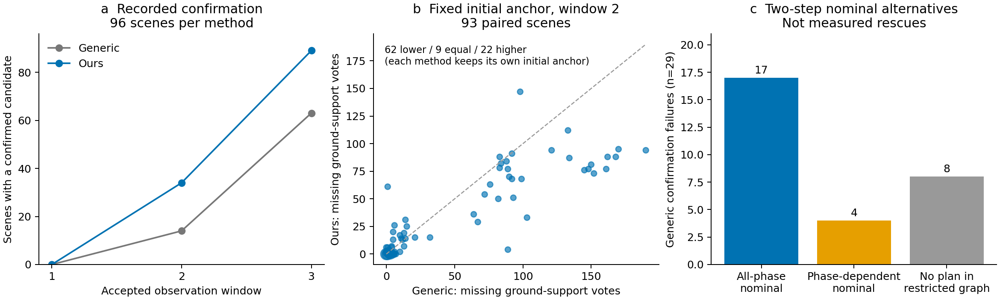

# Completion-aware 离线验证：结果与边界

本报告仅分析已有 212 个正式任务，不修改运行方法、配置、原始结果或论文统计，不启动仿真。新的离线分析属于**开发性、事后分析**，不能作为新算法的独立测试。

## 结论

结果支持研究“候选确认导向的两步观测”，但不足以证明它提高 physical retrieval success。最有价值的发现不是选择了多少个不同视点，而是：**16/29 个 Generic confirmation 失败的初始状态，存在完成等级严格优于历史首动作的两步替代方案；18/29 到第二窗口后才发现已经无法补足 ground-support 票数。**

当前不改在线算法。若随后开展方法开发，应先把 candidate confirmation 作为清楚、可验证的中间目标，不能将本次模型内可行方案直接命名为 retrieval-success prediction。

## 1. 数据、时序与预测定义

读取全部 212 个 selected task records、541 个实际保存窗口、18,653 条逐窗口 exact-winner candidate 记录。342 次已执行的相邻窗口转移用于事后校验，其中 325 次来自主实验。所有预期保存窗口均找到；没有为提前终止的任务补造窗口。

主实验 192 个任务中，5 个在形成首个完整快照前终止：slots 119/120、151/152 为 aerial target timeout，207 为 Ground map TF stale。它们保持原来的 VALID_TRIAL 结果，但没有 completion 预测输入。可分析初始状态为 Generic 93、Ours 94；第二窗口同场景配对为 93 组。总计 96 组 retrieval 结果不缩小分母。

### 从 mass reduction 改为候选支持条件的离线检验

令 \(H_t(x)\) 为保存的真实 `ground_presence_votes`，并令

\[
d_t(x)=\max(0,2-H_t(x)).
\]

\(\mathcal Q_t\) 只包括当前未 blocked、未越界的**原 exact per-cell winner**，不加入 non-winner，不重选 RM4D 候选。\(S_q\) 是其保存的 padded footprint cells。若未来窗口产生 ground hit \(a_k(x)\in\{0,1\}\)，候选确认条件为

\[
K_t(q,a_{1:b})=
\mathbf1\!\left[\forall x\in S_q,\quad
 H_t(x)+\sum_{k=1}^{b}a_k(x)\ge 2\right],\qquad b=3-t.
\]

存在一个候选可交接的条件为 \(K_t=\max_{q\in\mathcal Q_t}K_t(q,\cdot)\)：**候选内是 AND，候选间是 OR**，不同于 footprint 并集上的加权 uncertainty mass。这里固定当前阻挡证据，不假设未来不会出现未知障碍，也不把新 ground hit 写回 A2。

使用原有限扫描模型保存的 opportunity \(w_t(v,x)\)：

\[
L_t(v,x)=\mathbf1[w_t(v,x)=1],\qquad
A_t(v,x)=\mathbf1[w_t(v,x)>0].
\]

将 \(a_k\) 分别替换为 \(L_t\)、\(A_t\)，得到全相位保守充分条件和乐观必要条件。它们是**名义扫描模型内的界**，不是现实 ground-return 概率。乐观条件可能组合互不相容的 cell 相位，因此对仅乐观的提名方案另做联合相位复算。

两步方案只在**当前保存的 viewpoint catalogue** 中搜索。第二个 viewpoint 还必须符合从第一个 viewpoint 出发的原局部生成规则、flight bounds 和 A5 facade 过滤；原地不同 yaw 不允许，原姿态再采一个窗口允许。因此这不是完整未来 viewpoint lattice，更不是随新观测变化的最优反馈策略。

离线参考排序在读结果前固定为：全相位可确认优先，其次乐观可确认，再按原 displacement/yaw cost 的两步总和、稳定 view ID 排序。全部没有方案时 abstain。这是一个供检验的字典序规则，不冒充冻结 A4 scoring，也不声称 cost-optimal retrieval。历史首动作来自 `events.jsonl:A5_DECISION`，不用 Generic worker 中可能保存 Ours 提议的 snapshot `next_viewpoint`。

## 2. 29 个 Generic confirmation 失败：能预测多少？

要区分“预警历史动作风险”和“找到未执行的替代方案”。

| 初始窗口后的检查 | 数量 | 可支持的结论 |
|---|---:|---|
| 历史首动作下，即使允许最有利的受限第二步仍无乐观完成方案 | 20/29 | 可以提前标记完成风险，不是现实不可行证明 |
| 替代两步具有全相位名义完成条件 | 17/29 | 在当前模型内有强替代方案 |
| 仅有相位相关的名义完成方案 | 4/29 | 有机会，但不保证每种相位组合完成 |
| 当前受限两步图没有乐观方案 | 8/29 | 不能用本次搜索支持“换一个评分就能救回” |
| 替代首视点不同于历史首动作 | 21/29 | 其中只有 16 个是完成等级严格改善 |
| 第二窗口结束后所有可用候选均缺至少一个零票 cell | 18/29 | 只剩一窗口时，真实两票要求已不可能满足 |

20/29 是失败组内的事后覆盖率，不能当成经过独立校准的预测准确率。在全部 93 个 Generic 初始状态中，同一历史动作风险规则标记 22 个：20 个属于上述 confirmation-budget 失败，一个最终成功（Hard-026），一个之后 sensor capture timeout（Hard-003）。后者不是能判断反事实 confirmation 结果的样本，不能简单合并为二分类真/假阳性。

29 个失败场景中，配对 Ours 有 22 个实际 retrieval 成功，但两方法观测历史和运行时估计不同；这不是这 22 个 Generic 状态的反事实执行标签。

### 对 4 个仅乐观方案的联合扫描相位核验

只复算已提名方案，不扩充搜索或重新挑选方案。原扫描程序为 80 个 packet phase、每窗口 51 个 packets。每个两步方案检查全部 80×80 个联合起始相位，按 runtime perceived occluders 重建，所得逐 cell opportunity 与原保存数组一致至 \(10^{-12}\)。

| 场景 | 提名 view ID | 完成的联合相位数 / 6,400 | 改变相对 phase offset 时，完成相位比例的范围 |
|---|---|---:|---:|
| Hard-007 | 81 → 81 | 5,776 | 90.0%–95.0% |
| Hard-024 | 81 → 81 | 4,757 | 72.5%–83.75% |
| Hard-004 | 41 → 41 | 6,364 | 92.5%–100% |
| Hard-025 | 41 → 41 | 3,481 | 47.5%–73.75% |

四者均有共同相位解，但并非全相位成功。表中比例仅描述扫描相位情景，不是测得的成功概率，也未假设两次扫描相位独立均匀。相同 view ID 表示两个真实采样窗口，**没有增加单窗口票数或三窗口预算**。

逐个失败案例和提名 map poses 见 [generic_29_cases.csv](results/generic_29_cases.csv)。

## 3. Ours 成功是否具有不同 completion trajectory？

有，但应先看完整配对，再看成功条件子集。

| 实际记录指标 | Generic | Ours |
|---|---:|---:|
| 第二窗口结束前累计有 confirmed candidate | 14/96 | 34/96 |
| 三窗口内累计有 confirmed candidate | 63/96 | 89/96 |
| 原物理 retrieval success | 56/96 | 80/96 |

累计确认是已发生事件，提前结束后只保持“曾 confirmed”事实，没有填补第三窗口传感器数据。确认后仍有 Generic 7、Ours 9 个 retrieval 失败，说明 confirmation 不是 manipulation completion 的充分条件。

为避免每一窗口更换“最好候选”造成漂亮曲线，另固定各任务 round-1 anchor：最少缺票，再按 relevance、原 evaluation index 排序，之后不换。两方法使用各自正常感知得到的 anchor，不宣称两者是同一物理姿态。

在 93 组第二窗口可配对状态中：Ours 固定 anchor 的缺票数更少 62 组，相同 9 组，更多 22 组；配对差值中位数为 −2 票。若看可更换 anchor 的最少缺失 cell 包络，则为更少 53、相同 17、更多 23，中位差 −1 cell。两种口径均保留，不用包络代替单候选轨迹。

80 个 Ours retrieval 成功任务中，32 个第二窗口已确认，剩余 48 个第三窗口确认。第二窗口最少缺失 cell 中位数是 2；29 个 Generic confirmation 失败对应中位数为 87。此比较受成功/失败分组条件影响，只能解释轨迹差异，不能估计因果效果。80 个成功任务的初始状态有 75 个全相位两步方案、79 个乐观方案；第二窗口的预测应只在尚未确认的 48 个状态中解释（44 个全相位、47 个乐观），不能把已确认的 32 个算成新的预测成功。

完整逐候选轨迹、96 组配对及缺测均见 `candidates.csv`、`paired_trajectories.csv`。

## 4. 两步预测是否改变历史选择？

会，但“改变选择”本身不是改进证据。对 29 个 Generic 失败初始状态：21 个提名首动作改变，16 个完成等级严格提高，5 个只是同一完成等级下的成本/稳定排序变化。剩余 8 个 abstain。

作为对照，56 个 Generic retrieval 成功任务中也有 56 个改变首动作，只有 6 个完成等级严格改善；80 个 Ours 成功任务中有 72 个改变，只有 11 个严格改善。大量改变来自原 information-gain 目标与新字典序目标不同，不能据此声称成功率或飞行代价必然更好。

“严格改善”比较的是：提名方案等级，对比保留历史首动作后允许最好的受限第二步得到的等级，而不是故意让历史方法沿一个不利第二步继续。因而 16 个案例提供了比单纯 action disagreement 更有用的开发依据。

同时保留负面结果：Ours 的 5 个 confirmation 失败（Hard-023、012、020、014、003），初始状态全部没有受限两步乐观方案，第二窗口后也全部缺少至少一个零票 cell。**这些失败尚不能由本次 completion-aware 排序解决。** 没找到方案不证明完整未来 lattice 无解，也没有在离线阶段增加 viewpoint 搜索范围。

## 5. 预测和实际观测是否一致？

主实验 325 个已执行转移中，预测器只读前状态和实际选中的动作，后窗口仅作为校验标签：

- 93 次预测为全相位“至少一个候选可确认”，实际 90 次确认、3 次未确认。
- 候选级有 7 次全相位支持过度预测；其中 4 次有其他候选完成，不能只报告 OR 层面的 3 次失败而隐去它们。
- 152 次实际出现确认，131 次转移有乐观预测；**29 次实际确认发生在没有乐观预测的转移**。名义模型的“上界”显然不是现实观测上界。
- 在待补票支持区域的 35,380 个“模型全相位命中 cell×转移”中，203 个未得到实际票。它们彼此相关，不能当作 35,380 个独立样本计算置信度。

3 次 OR 层面过度预测是 Generic Easy-003、Moderate-009、Moderate-006 的窗口 1→2，最后都在窗口 3 之后 retrieval 成功。它们分别有 1、3、2 个所需全相位 cell 未收到 ground vote，没有新的已知 blocker。用公开 packet TF 恢复的机体姿态显示，窗口内相对名义 command 的最大位置差分别约 9.6、17.0、10.4 cm；最大倾角约 0.28°、0.33°、0.26°；实际 packet 数为 51、51、52。

这些记录证明固定名义姿态/扫描窗口并不等于实际采样几何，**尚不能把每个 missed cell 的原因归因于其中某个因素**。没有用有限差分、GT 或后验成功去修正预测。详见 `actual_transitions.csv` 和 `overprediction_pose_diagnostics.csv`。

## 6. 能否不使用 GT？

本次已做到。预测只依赖：

- 当前保存的 A1 exact winner、relevance、footprint 和 operational blocking；
- 当前 runtime MID360 派生 ground-support counts、A2 evidence；
- 当前 runtime perceived target 和 AMBIGUOUS endpoint sidecar；
- 公共 sensor extrinsic、扫描程序、当前 pose、候选与原 flight cost 配置。

不读取 Gazebo world/model state、真实 brick pose 或未来 observation 作为决策输入。seed、retrieval 结果、后窗口和实际 packet TF 仅用于配对与事后校验。扫描 CSV 与 publisher SDF 是现有传感器能力配置，不是场景真值。

因此可以实现不依赖 GT 的 **confirmation-oriented** 预测。要进一步称为 **retrieval-oriented**，还必须连接公开可检查的 Ground 执行条件，并验证其预测能力；不能从这次离线分析推导新方法的 grasp/lift 成功率。

## 7. 对下一步的判断

有足够理由做一个小范围、独立标记版本的 completion-aware 原型：保留 exact candidate—footprint incidence 和真实缺票数，评价剩余预算内“能否完成至少一个候选”，用两步而非单个 cell gain 检查动作价值。

但还不适合直接替换正式版本或给论文新增成功率结论。优先要验证的是：这个候选级目标是否能在实际扫描误差下改善确认，而不是把名义 17+4 个方案当作已救回的任务。应同时保留 8 个无方案 Generic 案例、5 个 Ours 失败、3 个过度预测作为反例；不为了它们成功去调阈值或追加预算。

本轮停在离线研究 checkpoint。在线验证、扩大两步 viewpoint 图、执行鲁棒性建模及算法修改均未开展。
