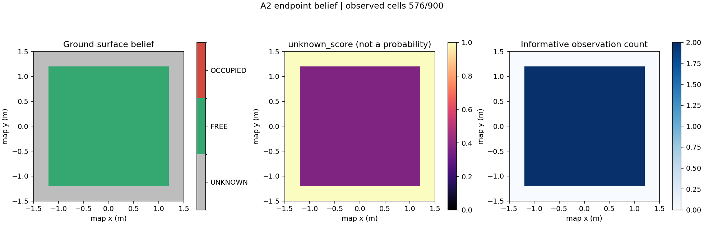
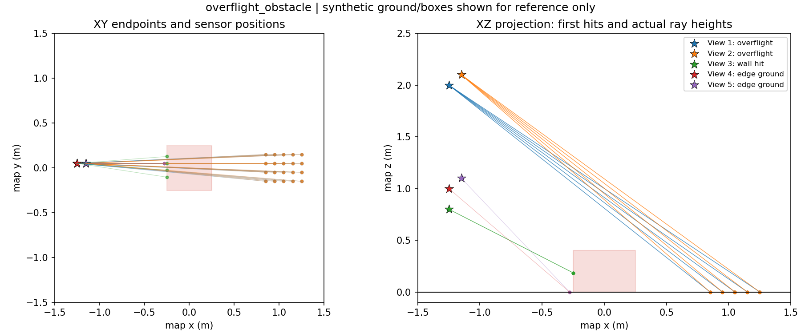
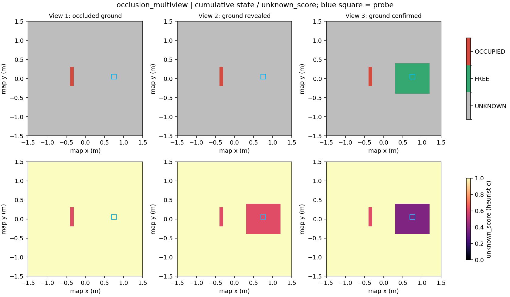

# A2 — MID360 Environment Belief

A2 最小原型：`sensor-frame return endpoints + T_map_sensor → map-frame environment belief`。
实现位于独立的 `environment_belief` 包，不导入 A1、RM4D 或 ROS。
本阶段仅用三组合成点云验证几何与证据语义，尚未连接真实 MID360 或 SIM topic。

## 1. 几何与证据定义

已知静态水平地面 `z = ground_z_m`，默认 0 m。调用方提供固定网格：
`map` frame、0.10 m resolution、显式 `origin_xy` 与宽高。网格不随 UAV 移动。
数组索引为 `[row, col] = [y, x]`，cell 是左闭右开的 XY 矩形：

\[
C_{r,c}=[x_0+cd,x_0+(c+1)d)\times[y_0+rd,y_0+(r+1)d),\quad d=0.10\text{ m}.
\]

每个有效端点先通过完整刚体变换，再计算地面相对高度：

\[
p_i^{map}=R_{map,sensor}p_i^{sensor}+t_{map,sensor},\qquad
h_i=p_{i,z}^{map}-z_{ground}.
\]

`T_map_sensor = T_map_uav @ T_uav_sensor`，不能只用 UAV 平移替代传感器 TF。
没有隐式 `world`/`map` 别名。点云须由调用方去畸变到参考时刻，或满足单一位姿近似。
时间戳用于记录该观测，不执行同步、扫描去重或 TF 查询。

默认端点规则如下；阈值是原型参数，不是已校准的 MID360 精度或通行标准。

| 条件 | 该端点提供的信息 |
| --- | --- |
| `abs(h) <= 0.02 m` | ground-support evidence |
| `h >= 0.05 m` | occupied evidence，投影到端点所在 XY cell |
| 其余高度 | ambiguous / out-of-model，不投票 |
| 无回波、无效标记、非有限 XYZ、零距离或超量程 | 不投票，不推断 free |
| 网格外端点 | 不给该网格投票 |

量程在 **sensor frame、变换之前** 判断，默认严格 `0.20 < range_m < 40.0`。
不设置 obstacle 高度上限，因此屋顶或悬空表面仍保守投影为 occupied。

对一次观测 `t`、一个 cell `C`：

\[
o_t(C)=\mathbf{1}[C\text{ 内存在 obstacle endpoint}],
\]
\[
f_t(C)=\mathbf{1}[C\text{ 内存在 ground endpoint}]\,(1-o_t(C)).
\]

同一帧同一 cell 无论有多少点，最多贡献一次有效投票，混合端点时 occupied 优先。
从零开始累积：

\[
O_t=O_{t-1}+o_t,\quad F_t=F_{t-1}+f_t,\quad N_t=O_t+F_t.
\]

输出状态为：

\[
s(C)=\begin{cases}
\mathrm{OCCUPIED}, & O(C)>0,\\
\mathrm{FREE}, & O(C)=0\ \land\ F(C)\ge2,\\
\mathrm{UNKNOWN}, & \text{otherwise}.
\end{cases}
\]

跨观测同样 occupied 优先：后续 ground votes 会保留在 `F` 中，但不会清除既有 occupied。
这是静态场景累积，不含动态清障或时间衰减。观测重排序不改变最终结果。

`FREE` 的含义仅是“重复观测到地面支撑，且没有观测到该 cell 内的地上障碍端点”。
它不是整 cell、整竖直柱或 BUNKER 车体的 clearance 证明。
`UNKNOWN` 同时包含从未有效观测和仅有一次地面支持的 cell；计数字段区分这两者。

## 2. unknown_score，而非概率

\[
u_{\mathrm{unknown}}(C)=\exp[-N(C)/\tau],\qquad \tau=2\text{ observations（默认）}.
\]

API/文件字段统一使用 `unknown_score`。这是 **observation-deficit heuristic**，
不是校准概率、occupancy probability、entropy，也不是 O/F 冲突度。
`N=0,1,2` 时分别为 `1, 0.606531, 0.367879`。
状态与 score 分开：一次 obstacle vote 即可为 OCCUPIED，score 仍为 0.606531；
两次 ground votes 变成 FREE，score 也不必变为 0。

一次 `update` 表示一条新观测。同帧密集点不会虚增计数，但重复提交同一扫描会增加计数，
调用方须避免重放。同视点新扫描也可以累计，不声称不同扫描统计独立，不统计独立视点数。
混合 O/F 证据可能仍使 score 降低，必须结合两种 evidence 和 occupied-priority state 解读。

## 3. 为什么适合 airborne MID360 的第一版

空中 3D LiDAR 的射线可能越过低障碍抵达远处地面。射线的 XY 投影经过某个 cell，
不等于该 cell 地面可通行。本实现 **只更新真实回波端点所在 cell**，完全不做 ray carving、
插值、膨胀、补洞或 smoothing。未观测地面、遮挡背面以及无回波区域均不由射线路径推断 free。

代价是覆盖保守且稀疏；本原型验证的是 sampled ground-surface belief，不是完整环境重建。
合成器内的 ray/box 交点仅用于生成遮挡正确的第一回波，不参与 belief 更新。
合成扫描不模拟 MID360 扫描花纹、测距噪声或飞行运动。

已知边界保留：

- 地面已知且水平；不做地面拟合、坡面、负障碍物或动态物体处理。
- 默认 0.05 m 以下的低障碍不被解析为 obstacle；ground tolerance 内的点可提供地面支持。
- overhead projection 保守标 occupied，不判断桥下/架下通行或竖直 clearance。
- 接入时需有效的 map pose、完整安装外参以及必要的点云去畸变；自机回波由输入适配器屏蔽。
- 当前 SIM `/uav1/livox/lidar` 使用 `prometheus_msgs/LivoxCustomMsg`，不是直接可用的
  `sensor_msgs/PointCloud2`；其无效量程可产生零 XYZ。A2 已过滤零距离，但没有新增 ROS adapter。
  SIM 安装外参以现有 `p450_mid360_tf_contract.yaml` 为准，A2 不硬编码。

## 4. API 与数据结构

核心见 [core.py](../src/environment_belief/core.py)，输出见
[outputs.py](../src/environment_belief/outputs.py)。核心依赖仅 NumPy，绘图按需导入 Matplotlib。

```python
import numpy as np
from environment_belief import (
    BeliefConfig, EnvironmentGridSpec, EnvironmentBeliefMapper,
    PointCloudObservation,
)
from environment_belief.outputs import save_belief, render_belief

grid = EnvironmentGridSpec(
    origin_xy=(-1.5, -1.5), width_cells=30, height_cells=30,
    resolution_m=0.10, frame_id="map",
)
mapper = EnvironmentBeliefMapper(grid, BeliefConfig(), sensor_frame="lidar")

# 独立可运行示例：sensor 在 map 的 (0, 0, 2)，端点落在地面。
# 实际使用时，每次接收新点云及其参考时刻的完整 T_map_sensor。
T_map_sensor = np.eye(4)
T_map_sensor[:3, 3] = [0, 0, 2]
for stamp_s in (0.0, 1.0):
    cloud = PointCloudObservation(
        points_xyz=np.array([[0.15, 0.15, -2.0]]),  # sensor-frame meters
        frame_id="lidar", stamp_s=stamp_s,
        T_map_sensor=T_map_sensor,
        valid_return=np.array([True]),  # 可省略，默认全部有效
    )
    diagnostics = mapper.update(cloud)
    belief = mapper.snapshot()

save_belief(belief, "outputs/a2_example")
render_belief(belief, "outputs/a2_example/belief.png")
```

`update(observation) -> UpdateSummary` 原地累积到同一网格，并返回点数过滤诊断、ground/obstacle
端点数与 free/occupied cell 投票数。过滤分类之和等于输入点数；cell 投票数不是端点数。
`snapshot() -> EnvironmentBeliefGrid` 返回独立只读数组，后续更新不会改变旧快照。

| 字段 | 类型 / 含义 |
| --- | --- |
| `frame_id`, `origin_xy`, `resolution_m`, `width_cells`, `height_cells` | 固定 map 网格元数据；亦保存在 `grid` |
| `state[H,W]` | int8；UNKNOWN=-1、FREE=0、OCCUPIED=100 |
| `occupied_evidence[H,W]` | int64，累计 occupied observation votes，O |
| `free_evidence[H,W]` | int64，累计 free observation votes，F |
| `observation_count[H,W]` | int64，有效 cell-observation 次数 N=O+F |
| `unknown_score[H,W]` | float64，exp(-N/unknown_scale) |
| `config` | 地面、阈值、量程、free_observations、unknown_scale |

`EnvironmentGridSpec` 支持显式分辨率参数；本阶段固定使用 0.10 m。
改分辨率、地面参数或网格范围时应新建 mapper，不把不同网格/模型的计数混用。

## 5. 三组离线结果

所有场景使用同一 `[-1.5,1.5) × [-1.5,1.5)` 地面区域、30×30 cells、0.10 m grid。
输入来自地面/实体箱体的最近正向交点，先转换成 sensor-frame XYZ，再经公开 API 更新；
ground-truth box 信息只用于生成输入与参考绘图，不传给 mapper。

| 场景 | 新观测数 | 最终 FREE | 最终 OCCUPIED | 最终 UNKNOWN | 验证行为 |
| --- | ---: | ---: | ---: | ---: | --- |
| clear | 2 | 576 | 0 | 324 | 一次支持仍 UNKNOWN，两次支持变 FREE，外围未观测区保持 UNKNOWN |
| overflight-obstacle | 5 | 20 | 4 | 876 | 前两次越障射线不更新障碍投影区；侧面回波后 occupied；后续地面证据不能覆盖 occupied |
| occlusion-multiview | 3 | 72 | 5 | 823 | 遮挡区无计数；换视点后一次 ground support 仍 UNKNOWN，第二次才 FREE |

overflight 的探针 cell `[15,12]` 同时容纳箱体侧面与箱边真实地面，序列为：

| 观测 | O | F | N | state | unknown_score |
| --- | ---: | ---: | ---: | --- | ---: |
| 高空越障 1 | 0 | 0 | 0 | UNKNOWN | 1.000000 |
| 高空越障 2 | 0 | 0 | 0 | UNKNOWN | 1.000000 |
| 侧面回波 | 1 | 0 | 1 | OCCUPIED | 0.606531 |
| 箱边地面 1 | 1 | 1 | 2 | OCCUPIED | 0.367879 |
| 箱边地面 2 | 1 | 2 | 3 | OCCUPIED | 0.223130 |

occlusion 的隐藏地面探针 `[15,22]` 为 `N: 0 → 1 → 2`，
`state: UNKNOWN → UNKNOWN → FREE`，`unknown_score: 1 → 0.606531 → 0.367879`。
这些计数描述观测端点覆盖，不代表箱体完整 footprint 已重建。

### 可视化

图像直接绘制 cell，无 smoothing。灰/绿/红分别表示 UNKNOWN/FREE/OCCUPIED；
score 色标固定为 [0,1]。几何图中的射线仅作解释，不表示 free evidence。

Clear 最终 state / unknown_score / observation_count：



Overflight XY 与 XZ 侧视图：前两次射线从 0.4 m 高箱体上方通过。



Occlusion 多视点累积，蓝框为隐藏地面探针：



另见 [overflight 逐观测状态](../outputs/a2/overflight_obstacle/progress.png)、
[overflight 最终 belief](../outputs/a2/overflight_obstacle/belief.png)、
[occlusion 几何](../outputs/a2/occlusion_multiview/observations.png)。

### 运行与输出

仓库根目录执行（使用当前已有 NumPy/Matplotlib 环境，无新增依赖）：

```bash
PYTHONPATH=src MPLCONFIGDIR=/tmp/a2-mpl XDG_CACHE_HOME=/tmp/a2-cache \
/media/lu/P450_PAPER/RM4D_AUBO/conda-env/bin/python -W error \
  scripts/run_a2_offline_validation.py --output-root outputs/a2
```

脚本只运行上述三组演示，并覆盖指定目录内同名结果文件。每个场景目录包含：

- `belief.npz`：最终五个数组与 map/grid 元数据。
- `summary.json`：配置、状态计数、有效观测数量及 score/FREE 语义。
- `belief.png`、`observations.png`、`progress.png`：最终网格、几何、多视点演化。
- `sequence.json`：逐次更新诊断与探针读数。
- `sequence.npz`：逐次五个数组 `[T,H,W]`，以及各次输入
  `view_i_points_xyz / T_map_sensor / valid_return / stamp_s`（i 从 0 开始）。
  配合 summary 的网格/配置与 sequence.json 的 sensor_frame，可重放到新 mapper。

测试命令：

```bash
PYTHONPATH=src MPLCONFIGDIR=/tmp/a2-mpl XDG_CACHE_HOME=/tmp/a2-cache \
/media/lu/P450_PAPER/RM4D_AUBO/conda-env/bin/python -W error \
  -m unittest discover -s tests -v
```

A2 增加 23 项测试，覆盖 frame/刚体变换、过滤、阈值、投票、occupied priority、
网格边界、快照独立性、序列化、无平滑绘图以及三组物理遮挡场景。
不重跑冻结 RM4D，不建立 benchmark 或额外执行框架。

本次最终验证：95 项测试通过（原有 A1 72 + A2 23），warnings-as-errors 下无失败；
新模块和脚本编译通过。三组保存输入逐次重放后，所有中间/最终数组与提交结果一致。
代码审查发现的内部 cell 边界浮点舍入问题已用直接边界比较修正，并加入边界两侧测试。

## 6. A3 接口边界（未实现）

未来 A3 由外部调用方为 A1 和 A2 提供完全一致的 `frame_id / origin_xy / resolution / shape`，
再读取 A1 的 validated relevance 与 assessment coverage，以及 A2 的 state、O/F/N 和
`unknown_score`。分辨率相同但 origin 不同不能直接逐 cell 融合。

A1 cell 表示 BUNKER `base_link` 地面位置的 manipulation relevance；A2 cell 表示观测端点
所在的地面区域。直接同址关联可以用于研究，但不能自动证明整车 footprint 可通行。
A3 若研究车体可用性，需要另行明确 footprint/环境证据支持区域，不在 A2 添加该机制。

A1 `UNASSESSED` 是未进入有限 validation budget，不能补成低 relevance 或不可达；
A2 `UNKNOWN` 是环境端点证据不足，不能与 A1 assessment 状态混淆。
后续可研究“已评估 manipulation interest 高、环境 observation-deficit 高”的区域，
但这里不实现乘积、task weighting、task-relevant uncertainty、NBV 或 active perception。
`unknown_score` 仍是 heuristic，不能直接当概率代入信息熵或 information gain。

A1 源码、接口、方法、输出和既有测试均保持冻结；A2 在本独立 feature branch 完成后停止。
