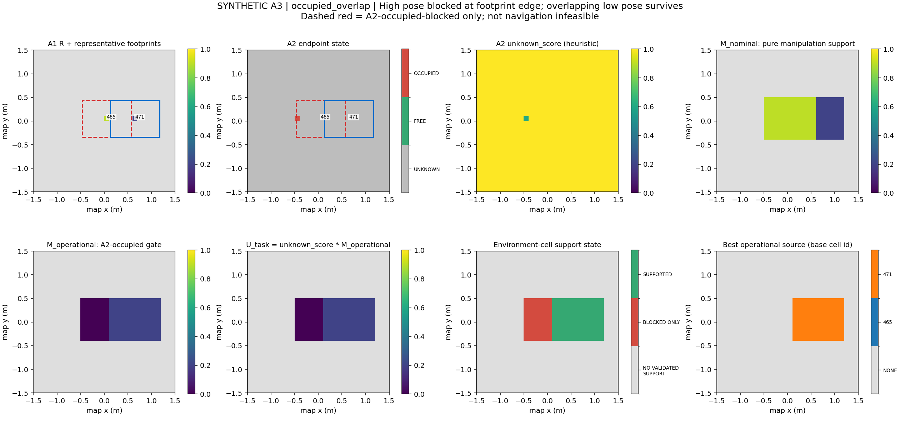
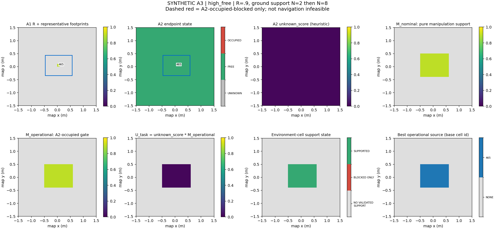

# A3 — Task-Relevant Uncertainty

最小 ROS-independent 原型：

`A1 Validated Manipulation Interest Field + BUNKER footprint + A2 Environment Belief → A3 field`

A2 已经通过 [PR #2](https://github.com/Dellsonorb/reachability_guided_aerial_perception/pull/2)
合并到 `main @ 8d53cae`，合并树与完成版本 `51f9a65` 一致。
A3 在该 main 上创建的 `feature/a3-task-relevant-uncertainty` 中独立实现；不修改 A1/A2。

## 1. 数学定义

设 A1 的可支持 base cells 为
\(Q=\{q\mid s_{A1}(q)\in\{\mathrm{HIGH},\mathrm{LOW}\}\}\)。
每个 q 使用原 A1 的 relevance \(R(q)>0\) 与 \(\psi_q=\mathrm{best\_yaw}(q)\)。
令 \(F_q\) 为该代表 pose 的 BUNKER footprint 覆盖的环境 cells。

纯 manipulation-support 投影不使用 A2：

\[
M_{\mathrm{nominal}}(x)=\max_{q\in Q:\,x\in F_q}R(q).
\]

仅以 A2 的 OCCUPIED 端点证据定义阻断：

\[
b(q)=\mathbf{1}\left[\exists x\in F_q:\ s_{A2}(x)=\mathrm{OCCUPIED}\right].
\]

主 operational 投影与 task uncertainty 为：

\[
M_{\mathrm{operational}}(x)=\max_{q\in Q:\,x\in F_q,\ b(q)=0}R(q),
\]
\[
U_{\mathrm{task}}(x)=u_{\mathrm{unknown}}(x)\,M_{\mathrm{operational}}(x).
\]

多 footprint 重叠取 **max，不求和**，避免同一环境 cell 因候选密度变大而被重复加权。
相同 relevance 时使用 row-major 顺序的第一个 base source，结果确定。

`blocked` **仅指 A2-occupied-blocked**，不是完整 navigation infeasible。
一个 footprint 内任一 covered cell 为 OCCUPIED，会移除该 pose 对整个 footprint 的
operational 支持，而不仅把 occupied cell 自身置零。其他未阻断 pose 可以继续提供支持。
`M_nominal` 和 A1 的 `R(q)` 均不受此操作影响。

UNKNOWN 不阻断 pose，也不表示可通行。A2 FREE 仍使用其已有 `unknown_score`，不强制置零。
默认 A2 \(u_{\mathrm{unknown}}=\exp(-N/2)\)；A3 读取这个值，不重新估计或校准概率。
因此 A3 是 task-relevant **observation-deficit heuristic**，不是 entropy 或 expected information gain。

## 2. Footprint 与网格规则

输入必须都是 `map`，resolution 为 0.10 m，且 origin、shape 一致。
仅容许元数据 1e-9 m 的浮点误差，不自动重采样、平移网格或进行 world/map 别名转换。

base cell `[row,col]` 的代表位置为：

\[
q=(x_0+(col+0.5)d,\ y_0+(row+0.5)d),\qquad d=0.10\ \mathrm{m}.
\]

**cell center + best_yaw 是离散代表 pose，不声称 cell center 本身通过了原 candidate IK。**
A1 field 不存获胜候选的精确 XY，本版不额外读取 candidate 表恢复其位置，也不重新求 IK。
每轴中心近似误差最多约 0.05 m；其对真实可执行性有影响，必须保留这项研究边界。
同一 cell 只使用 A1 保存的一个 best_yaw，不搜索其他 yaw；不能把当前 pose 的阻断扩展成
“这个 cell 的所有朝向均不可行”。

BUNKER 的 `base_link` 局部矩形采用冻结 RM4D 的既有 padded vertices：

```text
(-0.52,-0.39), (0.52,-0.39), (0.52,0.39), (-0.52,0.39)  [m]
```

即 1.04 × 0.78 m，包含原 nominal 1.00 × 0.74 m 矩形的 0.02 m padding，不增加 padding。
配置来自本机 `RM4D_AUBO/configs/mr4_offline_base_placement.json` 的 footprint 字段；
与 SIM `bunker_navigation/config/costmap_common.yaml` 的 nominal footprint/padding 一致。
A3 将该尺寸作为显式 `FootprintSpec` 默认值，不导入或修改 RM4D/SIM，也不新增 ROS 参数层。

对局部 footprint 顶点 v，先旋转再平移：

\[
v^{map}=q+\begin{bmatrix}\cos\psi&-\sin\psi\\\sin\psi&\cos\psi\end{bmatrix}v.
\]

环境 cell 的 **闭矩形与旋转 footprint 相交** 就计入覆盖，包含边/角接触。
使用 separating-axis test：沿网格两轴、footprint 两轴检查投影区间相交，接触容差 1e-12 m。
与 A2 端点落入 half-open cell 的规则不同：这里测试的是整个 cell 面积/边界与 footprint 的关系。
只测试 cell 中心可能漏掉边缘障碍；轴对齐外包框又会填入旋转矩形之外的 cells，因此均不采用。
这不是 smoothing、膨胀、卷积或 hole filling。

footprint 越出网格时，仅返回网格内 covered cells，同时设 `footprint_clipped=True`。
越界部分不补 free、不假设已观测。若没有网格内 occupied 证据，pose 不因此 blocked，
但其环境状态为 UNCONFIRMED，即使网格内 covered cells 全为 FREE。
如需研究完整 footprint 的未知部分，调用方需另提供足够大的、相互对齐的 A1/A2 网格。

## 3. 状态组合与空集合

A1 与 A2 的状态是不同空间语义，即使数组索引相同也不能合并成同一个状态。

| A1 base-cell 状态 | 是否生成 source footprint |
| --- | --- |
| HIGH / LOW | 使用原 R 和 best_yaw |
| INFEASIBLE | 不生成；保留原状态，不臆造 yaw |
| UNASSESSED | 不生成；不是 R=0 或全局不可达 |

A1 `FieldStatus` 与 `AssessmentCoverage` 原样保留，包括 PARTIALLY_ASSESSED、有限 validation
coverage 和 NO_INVERSE_REACHABLE。A3 不补全 RM4D capability map。
某环境 cell 即便同址 A1 为 UNASSESSED，也可能位于邻近已评估 pose 的 footprint 内，
因此可获得 A3 support；这不会把该 cell 本身的 A1 状态改成 assessed。

每个实际投影 pose 的环境状态：

| `PoseEnvironmentState` | 含义 |
| --- | --- |
| NOT_PROJECTED (-1) | 此 base cell 没有生成代表 footprint |
| A2_OCCUPIED_BLOCKED (0) | footprint 中存在 A2 OCCUPIED cell |
| UNCONFIRMED (1) | 无 observed occupied，但有 UNKNOWN 或 footprint 越界 |
| OBSERVED_GROUND_SUPPORT (2) | 未越界且 covered cells 全为 A2 FREE |

最后一种仍只是 A2 的重复 ground-support 语义，不证明车体全体积 clearance 或路径可达。
A2 对 overhead 端点的保守 occupied 投影会传入 A3 的阻断判断；本版不另做 clearance 模型。

每个环境 cell 的输出支持状态：

| `SupportState` | M_nominal | M_operational / U_task |
| --- | --- | --- |
| NO_VALIDATED_SUPPORT (-1) | NaN | NaN；不代表任务无关 |
| BLOCKED_ONLY (0) | 保留纯 manipulation max | 0；所有已知支持 pose 都被 A2 occupied 阻断 |
| SUPPORTED (1) | 所有 source 的 max | 未阻断 source 的 max / 与 unknown_score 的乘积 |

NO_VALIDATED_SUPPORT 与 BLOCKED_ONLY 不能只凭“数值为零”混淆。
NO_INVERSE_REACHABLE 输入会保留该 A1 field-level 状态，并输出全网格 NO_VALIDATED_SUPPORT/NaN。

## 4. API 与数据结构

实现位于独立 [task_relevant_uncertainty 包](../src/task_relevant_uncertainty/)，核心为纯函数：

```python
from task_relevant_uncertainty import FootprintSpec, build_task_uncertainty
from task_relevant_uncertainty.outputs import save_task_field, render_task_field

# a1_field: frozen ManipulationInterestField
# a2_belief: frozen EnvironmentBeliefGrid snapshot
field = build_task_uncertainty(a1_field, a2_belief, FootprintSpec())
save_task_field(field, "outputs/a3_example")
render_task_field(field, "outputs/a3_example/field.png")
```

A2 多视点更新后，用新 snapshot 重算 A3 即可。A3 不自身累积 evidence，不把旧 U_task 再次相加。
输入不变，输出为 detached read-only 数组；不回写 A1/A2。

`TaskRelevantUncertaintyField` 保存：

| 字段 | 类型 / 含义 |
| --- | --- |
| `grid`, `frame_id` | 固定公共 EnvironmentGridSpec / map |
| `grasp_id`, `a1_status`, `a1_coverage`, `footprint` | 原 A1 元数据及显式 footprint 参数 |
| `nominal_task_relevance[H,W]` | float64，M_nominal |
| `task_relevance_at_environment_cell[H,W]` | float64，M_operational |
| `task_relevant_uncertainty[H,W]` | float64，U_task |
| `support_state[H,W]` | int8，SupportState |
| `nominal_support_count`, `operational_support_count` | int32[H,W]，两种 source 数量 |
| `best_nominal_source`, `best_operational_source` | int64[H,W]，各自最大贡献者，-1 表示没有 |
| `a1_cell_state`, `environment_state`, `unknown_score` | 分开保存的原输入数组副本 |
| `pose_environment_state[H,W]` | base-cell 网格上的 PoseEnvironmentState |
| `poses` | tuple[PoseSupport]，完整 footprint 支持关系 |

source ID 为 `base_row * width_cells + base_col`。
每个 `PoseSupport` 记录 source_id、row/col、代表 xy/yaw、原 relevance、环境状态、
blocked、footprint_clipped、covered FREE/OCCUPIED/UNKNOWN cell 数量，
以及 `covered_environment_cells`（row-major flat cell IDs）。
因此既能查 max 来源，也能追溯全部重叠支持关系；blocked source 记录不会被删除。

最小检查仅覆盖输入类型、grid/frame、消费数组的形状/数值/状态、正尺寸和有限 yaw。
没有 artifact lock、provenance、lifecycle、scan registry 或 verifier 框架。

## 5. 四组离线验证

共同区域为 `[-1.5,1.5) × [-1.5,1.5)`，30×30 cells，0.10 m。
**A1 候选是显式合成 fixture，经冻结 A1 offline builder 转为 field；不是实际 RM4D/IK 查询结果。**
A2 输入由真实 A2 更新器处理合成端点得到，亦不是真实 MID360/SIM 测量。
测试旨在验证 A3 空间组合语义，不声称真实机器人能力或感知性能。

| 场景 | M_nominal | M_operational | U_task（支持区） | 支持状态计数 |
| --- | --- | --- | --- | --- |
| high_unknown | 0.9 | 0.9 | 0.9，N=0 | 99 SUPPORTED，801 NO_VALIDATED_SUPPORT |
| high_free，N=2 中间结果 | 0.9 | 0.9 | 0.331091497 | 同上 |
| high_free，N=8 最终结果 | 0.9 | 0.9 | 0.016484075 | 同上 |
| low_unknown | 0.2 | 0.2 | 0.2，N=0 | 同上 |
| occupied_overlap | 高 footprint 0.9，低独有区 0.2 | 高独有区 0，其余支持区 0.2 | 0 或 0.2 | 54 BLOCKED_ONLY，99 SUPPORTED，747 NO_VALIDATED_SUPPORT |

高 pose source 465，代表 `(0.05,0.05,0)`；低 pose source 471，代表 `(0.65,0.05,0)`。
两个 footprint 各覆盖 99 cells，重叠 45 cells。occupied 回波落在 `(-0.45,0.05)` 的环境
cell `[15,10]`，位于高 footprint 边缘且远离 base 中心、不在低 footprint 内。
因此 source 465 被阻断，source 471 不被阻断。重叠探针 `[15,18]`：
`M_nominal=0.9`，`M_operational=U_task=0.2`，nominal source=465，operational source=471。

### 图像

每张图包含 A1 R/代表 footprint、A2 state、unknown_score、两层 M、U_task、support state
与 operational max source。score 统一 [0,1] 色标，无平滑；灰色 NaN 区不表示低 relevance。
红色虚线只标 A2-occupied-blocked footprint。





另见 [高 relevance + unknown](../outputs/a3/high_unknown/field.png)、
[低 relevance + unknown](../outputs/a3/low_unknown/field.png)、
[FREE N=2 中间结果](../outputs/a3/high_free/after_two/field.png)。

### 运行与保存数据

仓库根目录执行，无新增依赖：

```bash
PYTHONPATH=src MPLCONFIGDIR=/tmp/a3-mpl XDG_CACHE_HOME=/tmp/a3-cache \
/media/lu/P450_PAPER/RM4D_AUBO/conda-env/bin/python -W error \
  scripts/run_a3_offline_validation.py --output-root outputs/a3
```

每个场景有 `field.npz`（所有 field 数组及 grid 元数据）、`summary.json`（公式/状态/配置/coverage）、
`supports.json`（完整 pose→cells 关系）、`field.png`、`inputs.json`（合成 A1 请求/result 与配置）
及 `inputs.npz`（A2 五个原始输出数组）。`high_free/after_two/` 另存 N=2 的同类输出。
脚本只覆盖这些命名结果，不添加执行框架。

用 `inputs.json` 的 grasp/result 调用原 A1 offline builder，用 `inputs.npz` 和配置重建 A2
snapshot，再调用 A3，可数值重放这些组合结果。所有输入均标明 synthetic，不伪装真实验证。

测试命令：

```bash
PYTHONPATH=src MPLCONFIGDIR=/tmp/a3-mpl XDG_CACHE_HOME=/tmp/a3-cache \
/media/lu/P450_PAPER/RM4D_AUBO/conda-env/bin/python -W error \
  -m unittest discover -s tests -v
```

A3 新增 25 项测试（几何 7、组合 12、导出/场景/CLI 6），不重跑 RM4D 或建立 benchmark。

最终验证：**120 项测试通过**（原有 A1/A2 95 + A3 25），warnings-as-errors 下无失败；
新模块和脚本编译通过。四个最终结果与 N=2 中间结果均由保存的 A1/A2 输入重放，所有 field
数组逐项一致。限定范围的几何/核心与输出/场景审查均无未解决发现；A1/A2 文件未修改。

## 6. 与 A4 的边界

A4 将来可以读取 `U_task` 作为“哪些环境 cells 对已知 manipulation-support footprints
仍有较高观测缺口”的空间权重，同时读取 support sources、pose 环境状态和 A1 assessment
coverage，区分缺少环境证据与缺少 manipulation 评估。

但 A3 没有视点、相机/LiDAR visibility、遮挡预测、观测更新预测、飞行成本或 NBV 策略。
单个 view 是否能降低 U_task、降低多少，需要 A4 另建观测模型；不能直接把本 heuristic
称为 information gain。NaN 区域也不能未经说明当作“无需观测”。

本阶段完成后停止：不进入 A4、UAV flight、MID360 ROS/SIM 接入、RL/World Model、benchmark
或额外 safety/evidence framework。
