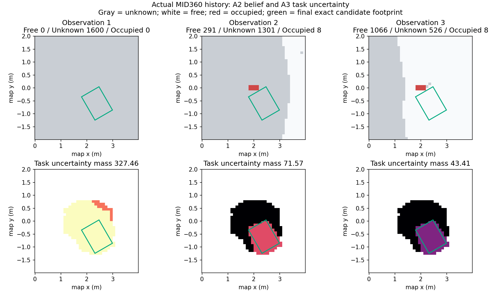
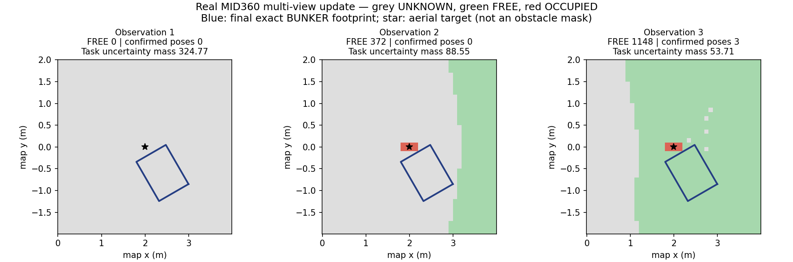
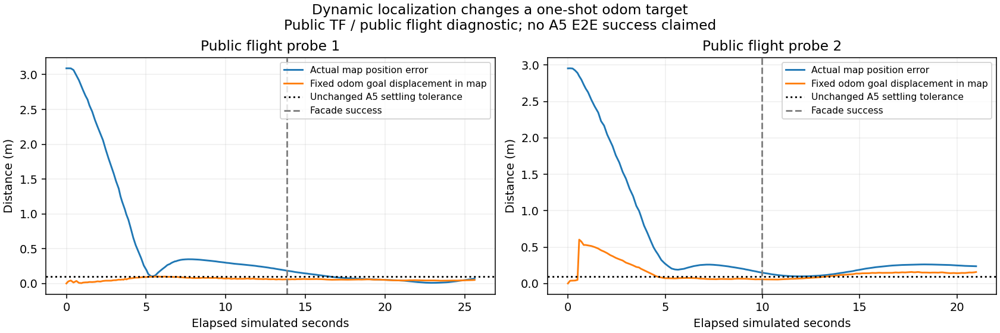
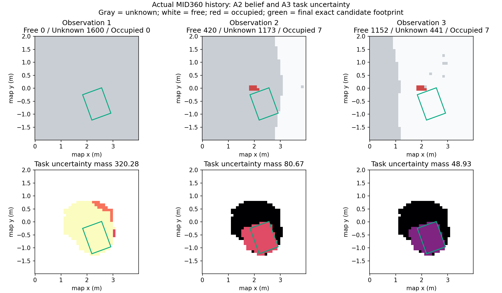

# A5 — SIM active-perception integration (minimal E2E verified)

Current status: the authorized **Ground reference-frame bridge and independent
task-domain RM4D asset are verified**; the repaired UAV public TF also passes
real ground-height checks. The frozen map remains unchanged. The separate
runtime asset adds negative flange coverage and an explicitly calibrated floor;
see [asset geometry and actual SIM planning checks](A5_TASK_DOMAIN_ASSET.md).
Natural run `natural-approach-j87FQA` completed active observation, exact Ground
confirmation, navigation, D435 refinement, AG95 grasp and physical lift. The
unchanged SIM physical checker is **PASS**, finalized after clean runtime
teardown. Earlier failed attempts and the local integration fixes remain below.
A5 remains on its feature branch / [PR #5](https://github.com/Dellsonorb/reachability_guided_aerial_perception/pull/5);
AGENT main is not merged. Required SIM correction `5e25039` was delivered through
[Simulation-Platform PR #1](https://github.com/Dellsonorb/Simulation-Platform/pull/1)
and merged into SIM main at `2e7feaa7585425a13208741b10b4a4bd8e14fefa`.
The merged source tree is identical to the correction used in the successful run.

A4 was merged through PR #4 and is frozen at main `431a907`. A5 lives on
`feature/a5-sim-active-perception-loop`. This implementation adds only an
integration/orchestration layer; A1/A2/A3/A4 are unchanged. The subsequently
authorized public-map correctness repair is isolated in SIM branch
`feature/fix-sim-uav-map-localization`, not in these research modules.

## Completed natural demonstration

The same natural brick and initial clear-parking scene were used, with no
mid-run teleport. The controller consumed real sensor/public-TF inputs only.

| Result | Observed value |
|---|---:|
| Task-asset inverse / evaluated / valid candidates | 144 / 144 / 139 |
| Real MID360 observation windows | 3 (52 / 52 / 51 packets) |
| A4-selected translated NBV flights | 2 (2 m each) |
| Task uncertainty mass, after each observation | 327.46 → 71.57 → 43.41 |
| Confirmed exact candidates | 0 → 0 → 2 |
| Selected candidate 000008 exact footprint | 108 FREE / 0 UNKNOWN / 0 OCCUPIED |
| Ground travel | 1.9645 m |
| Post-refinement completed arm controller goals | 3 |
| Physical brick lift / TCP lift | 0.14861 m / 0.14955 m |

Selected exact BUNKER pose: `(2.396173919, -0.600217980, 2.094395102)` in map
`(x,y,yaw)`, with relevance 1.0. FREE retains mean unknown_score 0.367879. The
stop was `VIEW_BUDGET_REACHED`, with best remaining predicted score 17.0804:
this is the three-observation runtime guard, **not** Score≤0 or convergence.
Task mass reflects both observation-deficit updates and occupied pose exclusion;
it is not calibrated information gain or a comparison against another method.

D435 produced a fresh map observation, AG95 confirmed the actual grasp, and the
independent checker observed the full status sequence, landing, three successful
post-refinement arm goals and the physical target height increase. All three
saved scan windows placed the known-clear ground patch within A2's unchanged
0.02 m tolerance (worst absolute error 0.001085 m). No A2 ground offset or
threshold relaxation was used.

- [Complete run summary](../outputs/a5/natural-approach-j87FQA/run_summary.json)
- [Existing independent physical checker: PASS](../outputs/a5/natural-approach-j87FQA/physical_summary.json)
- [Known ground returns from all three real windows](../outputs/a5/natural-approach-j87FQA/known_ground_from_saved_windows.json)
- [Exact candidate decision](../outputs/a5/natural-approach-j87FQA/decision.json)



This completes one minimal natural integration demonstration, not a benchmark,
repeatability estimate or real-robot robustness claim. No further stage is started.

## Implemented boundary

`scripts/run_a5_sim.py` subclasses the existing SIM `AirGroundPickDemo`. It
replaces the aerial phase and RM4D candidate provider, and wires the exact
aerial and D435-refined grasps into approach-compatible pregrasp selection through
existing MoveIt services. Ground navigation, perception, Cartesian descent,
AG95 confirmation and lift retain the existing SIM implementation. No Gazebo
model state enters the algorithm.

The Python 3.8 ROS adapter consumes actual `/uav1/livox/lidar` PointCloud2,
filters nonfinite/zero returns, waits for stable position/yaw/velocity, and
collects a 5-second scan window per observation. Every packet uses its own
header timestamp for the full `T_map_sensor`. The mount includes
pitch 0.35 rad and the ray-sensor translation, not just a yaw rotation. A delayed
cloud must also have a current-position-consistent UAV pose at its own timestamp.
Flight arrival is checked against the requested viewpoint. After a potentially
long RM4D query, capture records a fresh measured anchor and logs its difference
from the request. Initial settling is unchanged. During acquisition, the anchor
provides the yaw reference, while slow current/stamped common position drift is
allowed inside the operating bounds. A delayed packet must be within 0.10 m of
the current position, not the original anchor. Fresh health/TF, low speed and yaw
checks remain active. The anchor is never rewritten; A4 receives the last actual
stamped UAV pose. See the [separate runtime diagnosis](superpowers/specs/2026-09-07-a5-low-speed-acquisition-design.md).
Packets are re-expressed in the last sensor frame/time. Each entire window is
one A2 observation, never extra votes proportional to packet count. This is
between-packet coordinate alignment during hover, not within-packet deskew.
If current/stamped acquisition checks fail during collection, discard the partial
window, wait for the same continuous settling interval, and start with fresh
packets. The original 20-second wall capture deadline is not reset. An incomplete
window never updates A2; frame/numeric errors are not reinterpreted as evidence.

The Python 3.10 worker calls the unchanged RM4D planner once using the existing SIM query-only
regularization and retains the complete evaluated result and unmodified grasp
TCP. The new A5-only `FrameBridge` reads the public nominal Ground reference
height and verifies its mount against frozen RM4D; it translates the query into
the original RM4D `world` frame and translates global result transforms back
to public map. `initial.json` retains the raw reference result (`task_domain_result`
for the explicit task asset, otherwise `baseline_result`), map `result`, and
`frame_calibration` separately. This is not an A2 ground correction: A2's ground
remains z=0 and A1–A4 are unchanged.
Each observation request replays its small ordered cloud history into an
empty A2 mapper, then invokes the frozen A3 and A4 functions. This does not add
extra votes to an already accumulated belief.

The optional `--wait-for-status-subscriber` is only for a connected external
diagnostic/checker: before any transition or flight, wait up to two wall seconds
for its ROS transport. Normal runs do not require a status subscriber. A5's
same-topic latched status publisher has queue 10 to retain short transition
bursts; no event replay or checker modification is used.

Defaults: fixed map/0.10 m grid, 4 m square around the observed grasp, 3 total
observations including initial/rescans, XY offsets {-2,0,2} m, flight weight
0.25, operating bounds x[-4,4], y[-3,3], z[0.5,3] m. These are integration run
settings, not a new planner. A4 yaw-only goals within the current flight facade's
position tolerance remain conservatively excluded because facade success does
not certify yaw completion. Translated yaw goals and current-pose rescans remain.

Stop on `NONPOSITIVE_SCORE`, `NO_PREDICTED_TASK_GAIN`, or
`VIEW_BUDGET_REACHED`. The latter is a guard, not convergence. Recover the original
per-A1-cell winning candidate (including continuous x/y/yaw and first-tie order),
not the cell center. Select the highest-relevance candidate whose **exact**
unclipped footprint is all A2 FREE and whose A3 representative is not occupied
blocked. FREE may retain positive unknown_score. This is observed-ground support,
not a proof of navigation/clearance feasibility. At a stop without a confirmed
candidate, abort; do not execute an unknown footprint or substitute generic NBV.

The request/response API is documented in the
[design](superpowers/specs/2026-09-07-a5-sim-active-perception-loop-design.md).
Saved point clouds, per-request responses and plots are ordinary debugging data,
not an evidence framework. The current renderer saves the latest A2/A3/A4 snapshot;
individual round response JSONs and cloud history remain available for replay.

## Actual Gazebo attempt: `gazebo-WwmQis`

The natural SIM scene used the existing brick at (2,0,0.0575), BUNKER at
(3,0,0.36), yaw pi, and initial aerial view (-0.5,0,1.5), yaw 0. No object or base
was teleported during execution. The UAV took off, reached the initial view,
obtained the aerial grasp estimate, ran RM4D and captured one real MID360 scan.

| Quantity | Observed result |
|---|---:|
| RM4D evaluated / valid | 256 / 180 |
| A1 per-cell winning candidates | 21 |
| MID360 valid endpoint rows | 1608 |
| A2 UNKNOWN / FREE / OCCUPIED cells | 1523 / 0 / 77 |
| A3 occupied-blocked representatives | 21 / 21 |
| Task uncertainty mass | 0 |
| Stop | `NO_PREDICTED_TASK_GAIN` |
| Confirmed exact candidate | none |
| A4-selected flight / ground execution / grasp / lift | **not reached** |

The adapter reported failure and used inherited landing cleanup. The dedicated
runtime was then stopped. This is an unsuccessful integration attempt, not a
successful active-perception demonstration and not evidence that A4 improves
ground decisions.

- [Decision and exact candidate diagnostics](../outputs/a5/gazebo-WwmQis/decision.json)
- [Frozen RM4D input/result](../outputs/a5/gazebo-WwmQis/initial.json)
- [Actual cloud and stamped transform](../outputs/a5/gazebo-WwmQis/observation_01.npz)
- [A2 summary](../outputs/a5/gazebo-WwmQis/a2/summary.json)
- [Existing SIM physical checker: FAIL](../outputs/a5/gazebo-WwmQis/physical_summary.json)


The reused frozen A4 renderer's footer “no real scan or flight” describes its
candidate visibility/gain prediction, not the origin of this A5 input: the input
scan above is real SIM data; proposed NBV observations are not measurements.

## Geometric prerequisite exposed by the original run

The original public TF did not place the observed horizontal ground within
A2's fixed map-ground band. With the correctly stamped composite transform,
distant returns in the saved hover scan form a near-plane at approximately
`z = 0.00249*x + 0.00921*y + 0.04940` m. At (2.8,0), that is about **0.0564 m**,
above frozen A2's **0.05 m occupied threshold**, rather than within its
ground band `0 +/- 0.02 m`. This plane fit was performed only as an offline
diagnostic; it was not used to correct the input or update A2.

A separate read-only check after landing found:

| Quantity | map/world z (m) |
|---|---:|
| Public `map -> uav1/base_link` TF | 0.1452550120 |
| Gazebo physical UAV pose, external diagnostic only | 0.0446725372 |
| Difference | 0.1005824748 |
| Distant return plane intercept in public map | 0.09991238 |

The stationary cloud timestamp was 279.553 s and the diagnostic model-state
timestamp 279.597 s. The close agreement between height offset and apparent
ground elevation supports a localization/frame-datum issue, not an A5 rotation
or timestamp substitution. At the time, SIM used a static `map -> uav1/odom` offset
based on spawn position plus the onboard estimated pose; see SIM
`air_ground_standalone.launch:34`. Sensor extrinsics include the expected ray
offset and match the published contract.

The current BUNKER also occupies part of the candidate area. Those body returns
were not masked or relabeled FREE. Their contribution must be separated from
misregistered ground once the TF prerequisite is resolved; this run does not
justify treating every occupied cell as a false obstacle.

The failure invalidates the **direct-input assumption for this SIM run**, not the
paper's task-weighting hypothesis. Changing A2 thresholds, adding adaptive ground
segmentation, or substituting Gazebo truth would alter the tested assumptions or
cross the platform boundary. None was done. This prompted the separately
authorized SIM repair below, after which A5 resumed with frozen A2 semantics.
At that point A5 was not merged or complete. The successful retry is above.

## Authorized platform repair and corrected retry

The WIP A5 checkpoint `eb33ea4` has been pushed to its feature branch without
merging main. In SIM, the incorrect static spawn-based map/odom edge has been
replaced by a same-time full-SE(3) localization correction. A SIM-private stamped
physical body pose is consumed only inside that platform adapter. AGENT still
uses only public map TF; no empirical Z offset, threshold change, body masking
or Gazebo pose substitution was added to A2/A5.

In corrected run `calibrated-mexIjS`, actual known-ground returns had maximum
absolute height error **0.000000402 m landed** (5 frames) and **0.0006364 m in
hover** (10 frames), both within the unchanged A2 0.02 m tolerance. Physical
landed base_link height remained approximately 0.04484 m. Public P450/Ground TF
and P450 D435 frame checks passed.

The first fresh A5 scan now provided 126 ground/free votes and 50 occupied votes.
All 31 representative candidates were still blocked, but the relevant occupied
endpoints were real current BUNKER/arm returns at z=0.394..1.028 m, rather than
misregistered ground. This run correctly stopped with no executable candidate;
it is not a completed A5 result.

The next natural run parks BUNKER initially at (3,-2.5), yaw pi, outside the
candidate region. This is an explicit initial scene setting, not a mid-run
teleport or self-body evidence suppression. `--max-ground-travel 3.0` exposes the
existing SIM travel guard for that parking distance; it does not change RM4D
quality, A1 relevance, A4 cost or candidate ranking. The default remains SIM's
1.10 m unless explicitly overridden. Exact footprints must still be entirely
A2 FREE before Ground execution.

That clear-parking run (`clear-parking-iaOxLx`) executed two A4-selected flights.
Across three single-packet observations, task uncertainty mass changed
295.19 -> 274.15 -> 247.80, and FREE cells changed 0 -> 29 -> 86. However,
the best exact footprint had only 17/108 FREE cells; the adapter stopped at the
view budget without executing Ground. This motivated the 5-second scan-window
acquisition above, without changing the per-observation A2 vote or all-FREE gate.

## Running with the repaired SIM platform

Use a built SIM checkout containing main merge `2e7feaa` (correction `5e25039`),
not the older uncorrected platform. Set `SIM_ROOT` to that checkout and use it
consistently for launch, ROS setup and the adapter. Existing machine paths used
for the successful run were:

```bash
export SIM_ROOT=/media/lu/P450_PAPER/SIM/p450_sim_v1/.worktrees/bunker-a-implementation
export P450_PX4_ROOT=/media/lu/P450_PAPER/P450-PAPER/workspaces/dependencies/px4
export RM4D_ROOT=/tmp/rm4d-aubo-baseline-v1.14uZXq/repo
export RM4D_PYTHON=/media/lu/P450_PAPER/RM4D_AUBO/conda-env/bin/python
export RM4D_MAP=/media/lu/P450_PAPER/RM4D_AUBO/runs/formal-10m/data/rm4d_aubo_i5_joint_42/10000000/rmap.npy
export A5_RUN_DIR="$(mktemp -d -p "$PWD/outputs/a5" gazebo-XXXXXX)"
bash scripts/run_a5_gazebo.bash "$A5_RUN_DIR" bunker_x:=3.0 bunker_y:=-2.5 \
  flight_position_tolerance:=0.05
```

`RM4D_ROOT` must name an available frozen baseline checkout; the temporary path
above is the checkout used for this attempt, not a portable installation promise.
The runtime-only wrapper delegates startup and Ctrl-C teardown to existing
roslaunch. In another terminal, use the same `A5_RUN_DIR` and dependency variables:

```bash
source /opt/ros/noetic/setup.bash
source "$SIM_ROOT/install/p450-clean/setup.bash"
export ROS_MASTER_URI=http://127.0.0.1:11951
/usr/bin/python3 -B scripts/run_a5_sim.py \
  --sim-root "$SIM_ROOT" --output-dir "$A5_RUN_DIR" --core-python "$RM4D_PYTHON" \
  --rm4d-root "$RM4D_ROOT" \
  --rm4d-config "$RM4D_ROOT/configs/mr4_offline_base_placement.json" \
  --rm4d-map "$RM4D_MAP" \
  --rm4d-task-asset assets/rm4d_ground_task_v1 --max-ground-travel 3.0 \
  --navigation-timeout 120 --facade-position-tolerance 0.05
```

For complete validation, start the existing SIM
`scripts/check_air_ground_pick_demo.py --summary "$A5_RUN_DIR/physical_summary.json"
--timeout 1200 --maximum-ground-travel 3.0` in a separate terminal before the
adapter. Then add `--wait-for-status-subscriber` to the adapter command above.
Keep the checker as the sole initial status subscriber. It independently
observes AG95 confirmation and physical lift, and supplies no control input.

## Verification and review

Final delivery review confirmed that the A5 runtime scripts/helpers and the
independent `assets/rm4d_ground_task_v1/{rmap.npy,metadata.json}` are tracked.
The required SIM Python and launch files in the tested install match the
committed correction; the frozen RM4D checkout remains clean at `e9d4312`.
The four remaining untracked diagnostic output directories are not runtime
dependencies. No temporary helper or uncommitted source change is needed.
An in-memory replay of all three saved observation histories reproduced every
recorded round decision and the known-ground diagnostics exactly. A ROS import
check also passed against a clean Git-exported SIM correction checkout.

Fresh delivery checks passed: 251 AGENT tests (no skips), 12 SIM facade tests,
59 SIM bringup tests, and 237 repository tests outside three old audit modules.
Full historical SIM test discovery is not green: clean main before this fix and
the correction both have the same 15 failure entries in the old import/layout,
boundary and extraction audit tests. They are documented in SIM PR #1, not
weakened or expanded into a new framework. The existing working checkout adds
one ignored-cache-directory failure; it is not a source regression.

Independent adapter spec review and whole-integration quality review found no
remaining blocking code issue. The latter checked exact identity, first ties,
representative/exact occupied gates, stamped transforms and stopped-response
semantics. The review does **not** establish Gazebo E2E completion.

Latest local verification: **251 tests passed** across frozen modules and A5;
the 54 ROS-independent acquisition adapter tests and 15 approach tests
also passed separately under system Python 3.8. Shell syntax and diff whitespace
checks passed; the frozen source-directory
diff against main was empty.

```bash
PYTHONPATH=src MPLCONFIGDIR=/tmp/a5-mpl XDG_CACHE_HOME=/tmp/a5-cache \
  "$RM4D_PYTHON" -m unittest discover -s tests -q
/usr/bin/python3 -m unittest tests.test_a5_ros_support -q
bash -n scripts/run_a5_gazebo.bash
```

No additional dependencies, baseline/ablation benchmark, security/evidence
framework, A6 stage or frozen-method changes were introduced.

## Calibrated fresh natural-scene retry

After the bridge's real SIM planning-only check passed, run
`calibrated-domain-run-XaSgKR` used the same natural scene and unchanged initial
parking, took off, and obtained a fresh aerial observation. Exact map TCP z was
0.082807036 m; reference query TCP z was -0.277192964 m. The frozen planner
returned inverse_reachable=0, evaluated=0, valid=0; A1 saved
`NO_INVERSE_REACHABLE`, consistent with the independent frozen-domain check.

The adapter then attempted its existing real MID360 capture. A partial window
of 26 packets was discarded after its unchanged hover gate failed, and the
20-second capture deadline expired. No full observation was accepted, so this
run did not update A2 or enter NBV/Ground/grasp/lift. This separate sampling
failure cannot explain or fix the already completed RM4D out-of-domain query.
No sampling gate, baseline map, exact target, or A2 threshold was changed.

- [Fresh actual initialization](../outputs/a5/calibrated-domain-run-XaSgKR/initial.json)
- [Fresh A1 status](../outputs/a5/calibrated-domain-run-XaSgKR/a1/summary.json)
- [Attempt summary](../outputs/a5/calibrated-domain-run-XaSgKR/run_summary.json)
- [Post-cleanup landed ground check](../outputs/a5/calibrated-domain-run-XaSgKR/landed_ground_check.json)

Inherited cleanup landed the UAV. Five actual ground-return frames remained
within the unchanged 0.02 m A2 tolerance (maximum absolute error 9.94e-6 m).
The task-owned runtime was then stopped.

This historical retry predates the subsequently authorized task-domain asset.
Its map-coverage issue is resolved by the separate asset described above, not
by another height offset. The retry itself is not an E2E success.

## Task asset and complete acquisition: `low-speed-dwell-7fKHEZ`

The calibrated task asset returned 144 evaluated / 139 valid candidates from
a fresh aerial estimate. With the bounded low-speed acquisition correction,
all three observation windows completed (51–52 actual MID360 packets, roughly
87,000 endpoints and 5.09 simulated seconds per window). These are three A2
votes per cell at most, not thousands of votes from the packets/endpoints.

| Observation | UNKNOWN / FREE / OCCUPIED | Task uncertainty mass | Confirmed exact candidates |
|---|---:|---:|---:|
| Initial | 1600 / 0 / 0 | 324.768 | 0 |
| After NBV 1 | 1220 / 372 / 8 | 88.553 | 0 |
| After NBV 2 | 444 / 1148 / 8 | 53.710 | 3 |

The first observation has no FREE cells because A2 requires two observations;
it does contain free evidence. Two A4-selected translations of about 2 m each
were executed through the public flight interface. The loop stopped at
`VIEW_BUDGET_REACHED`, not score convergence (best remaining score 20.989).
The exact selected candidate 000008 was (2.396970, -0.596781, yaw 2.094395),
with all 107 footprint cells FREE, none occupied/unknown, and relevance 1.
Its mean unknown score remained 0.367879, as permitted by A2's FREE semantics.

UAV return/landing, exact BUNKER navigation and D435 refinement completed.
The inherited refined pose-goal pregrasp selected an IK branch whose subsequent
Cartesian descent reached only fraction 0.767. The adapter aborted without
executing the descent or closing/lifting; the independent physical checker
reported failure. Read-only retries reproduced this branch issue, while a
fresh SIM check found collision-aware exact refined-grasp IK and complete
reverse approaches. This is handled separately from the validated task floor.

- [Actual run summary](../outputs/a5/low-speed-dwell-7fKHEZ/run_summary.json)
- [Failed branch diagnostic](../outputs/a5/low-speed-dwell-7fKHEZ/cartesian_branch_diagnostic.json)
- [Fresh local IK / reverse approach check](../outputs/a5/refined-approach-GYWLxP/refined_local_ik_diagnostic.json)
- [Full-mount reverse, joint-goal and forward planning check](../outputs/a5/refined-approach-GYWLxP/reverse_branch_planning_check.json)
- [Minimal A5 branch integration design](superpowers/specs/2026-09-07-a5-refined-approach-design.md)



The A5-only refined branch wiring retains SIM's exact generated grasp and full
stamped map-to-planning-frame transform. Collision-aware grasp IK is followed by
a reverse Cartesian approach; its endpoint is the joint goal for the ordinary
current-state planner. The existing forward continuation check must pass before
pregrasp execution. Original Cartesian step/fraction, collision checks, target
geometry, descent/close/lift sequence and TCP verification are unchanged. A
planning failure cannot execute motion, and execution failure is not retried.
The diagnostic using the complete mount (including x=0.15 m) found IK success,
reverse fraction 1.0, a 39-point pregrasp plan, and forward fraction 1.0; this
planning-only result is not itself an executed E2E grasp.

## Further natural runs and public map-goal tracking

`natural-refined-0coa8b` passed the unchanged initial settling gate, obtained
three observations and confirmed two exact candidates. A4 selected one major
diagonal translation (about 2.83 m) then a current-observation-pose rescan; the
facade made a short correction to that recorded pose after core-computation
drift. Task uncertainty mass fell 327.463 → 71.571 → 43.410. At the three-view
guard, candidate 000008 had 108/108 footprint cells FREE. Navigation exhausted
the inherited 60 s simulated-time guard near its exact goal: post-stop XY error
0.06057 m and yaw error 0.33094 rad. No D435/grasp/lift followed.

`--navigation-timeout` now optionally forwards the existing SIM runtime
parameter; absence preserves 60 s. The next run used 120 s for the roughly 2 m
Ground approach, retaining all goal tolerances/collision checks. That run,
`natural-nav120-HH1UP2`, instead stopped at the second UAV viewpoint's settling
gate after one complete observation; the longer Ground guard was never used.
The temporary baseline checkout had to be restored after session recovery;
the replacement is the identical detached e9d4312 commit, not the release
branch's later HEAD. `RM4D_ROOT` can also select the checkout for the task-map
integration tests. Missing local dependencies cause explicit skips, not passes.

A separate public-flight probe then established a platform translation issue:
the facade converts a map goal once to odom, while the repaired localization
updates map←odom dynamically. The second diagnostic flight reported success
at 0.1494 m map error; after 15 seconds, map error was 0.2366 m and speed
0.0885 m/s. The fixed odom target itself had shifted approximately 0.159 m in
map. The probe landed afterwards and is not counted as an A5 observation or
E2E success. This motivates the separate SIM
[map-target correction](superpowers/specs/2026-09-07-a5-public-flight-map-target-design.md),
not an empirical AGENT offset or a relaxed A2/arrival gate.

- [Navigation-limited actual run](../outputs/a5/natural-refined-0coa8b/run_summary.json)
- [Flight-limited actual run](../outputs/a5/natural-nav120-HH1UP2/run_summary.json)
- [Public flight / TF samples](../outputs/a5/natural-nav120-HH1UP2/flight_frame_probe.json)



SIM commit `5e25039` corrects only map-goal translation: each fresh odometry
snapshot supplies the TF time for command/completion/feedback; the final command
is also published, with cancellation retained across TF lookup. FLY_TO's
configured 0.05 m tolerance is separate from TAKEOFF's unchanged 0.15 m.
The bounded probe `map-fly-to-probe-NLl2v8` completed both flights at actual map
errors 0.04808/0.04968 m and then landed. Post-action hover still drifted, so
this is not continuous map stationkeeping. Public P450/Ground frames and P450
sensors passed their read-only checks. The separate ground-height checks remain
within the unchanged A2 band.

The next natural run, `natural-map-goal-SikHiu`, completed two translated NBV
flights and three real observations. Task mass was 320.28 → 80.67 → 48.93;
confirmed exact candidates increased 0 → 0 → 2. At the view guard, candidate
000009's exact footprint was 106/106 FREE and BUNKER successfully traveled
1.953 m. Its initial aerial-target pregrasp could not find a complete forward
continuation, so no D435 refinement/grasp/lift occurred. A planning-only probe
at that actual stopped base found IK success, reverse fraction 1.0, a 43-point
current-state plan and forward fraction 1.0. The existing A5 approach helper
is therefore reused before D435 as well as after refinement, without changing
its algorithm, exact targets or acceptance checks.

This run's physical checker also missed early transitions: ROS logs show
PREFLIGHT through TAKEOFF sent before its transport connected. Its FAIL is
retained, not relabeled. The bounded opt-in status transport wait above addresses
that distinct diagnostic issue; the checker and physical checks are unchanged.

- [Actual natural run and failure](../outputs/a5/natural-map-goal-SikHiu/run_summary.json)
- [Planning-only actual-pose approach check](../outputs/a5/natural-map-goal-SikHiu/actual_approach_planning_probe.json)
- [Two successful public FLY_TO probes](../outputs/a5/map-fly-to-probe-NLl2v8/flight_frame_probe.json)


