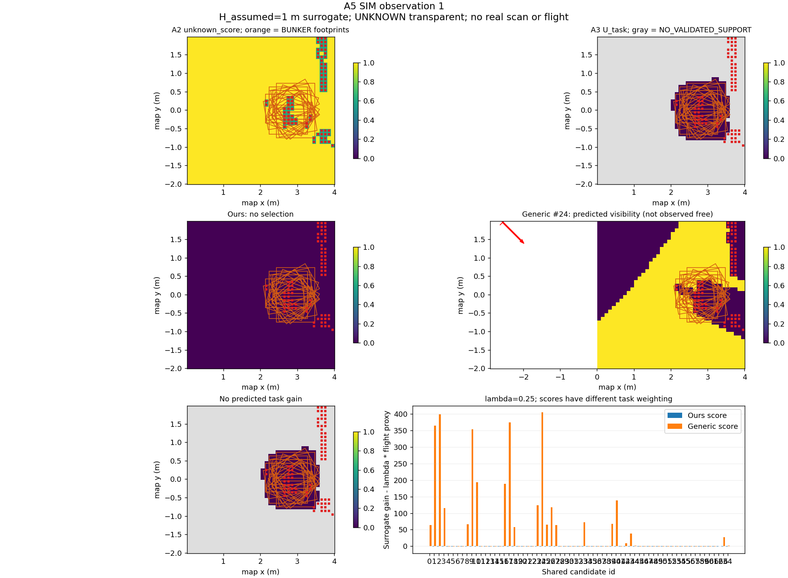

# A5 — SIM active-perception integration (not yet E2E complete)

A4 was merged through PR #4 and is frozen at main `431a907`. A5 lives on
`feature/a5-sim-active-perception-loop`. This implementation adds only an
integration/orchestration layer; A1/A2/A3/A4 and SIM source are unchanged.

## Implemented boundary

`scripts/run_a5_sim.py` subclasses the existing SIM `AirGroundPickDemo`. Only
the aerial phase and RM4D candidate provider are replaced. Ground navigation,
D435 refinement, MoveIt, AG95 confirmation and lift retain the existing SIM
implementation. No Gazebo model state enters the algorithm.

The Python 3.8 ROS adapter consumes actual `/uav1/livox/lidar` PointCloud2,
filters nonfinite/zero returns, waits for stable position/yaw/velocity, and
uses the cloud header timestamp for the full `T_map_sensor`. The mount includes
pitch 0.35 rad and the ray-sensor translation, not just a yaw rotation. A delayed
cloud must also have a goal-consistent UAV pose at its own timestamp.

The Python 3.10 worker calls frozen RM4D once using the existing SIM query-only
regularization and retains the complete evaluated result and unmodified grasp
TCP. Each observation request replays its small ordered cloud history into an
empty A2 mapper, then invokes the frozen A3 and A4 functions. This does not add
extra votes to an already accumulated belief.

Defaults: fixed map/0.10 m grid, 4 m square around the observed grasp, 3 total
observations including initial/rescans, XY offsets {-2,0,2} m, flight weight
0.25, operating bounds x[-4,4], y[-3,3], z[0.5,3] m. These are integration run
settings, not a new planner. A4 yaw-only goals within the current flight facade's
position tolerance are excluded because that facade may acknowledge them without
issuing a yaw command. Translated yaw goals and current-pose rescans remain.

Stop on `NONPOSITIVE_SCORE`, `NO_PREDICTED_TASK_GAIN`, or
`VIEW_BUDGET_REACHED`. The latter is a guard, not convergence. Recover the original
per-A1-cell winning candidate (including continuous x/y/yaw and first-tie order),
not the cell center. Select the highest-relevance candidate whose **exact**
unclipped footprint is all A2 FREE and whose A3 representative is not occupied
blocked. FREE may retain positive unknown_score. This is observed-ground support,
not a proof of navigation/clearance feasibility. At a stop without a confirmed
candidate, abort; do not execute an unknown footprint or substitute generic NBV.

The request/response API is documented in the
[design](superpowers/specs/2026-09-07-a5-sim-active-perception-loop-design.md).
Saved point clouds, per-request responses and plots are ordinary debugging data,
not an evidence framework. The current renderer saves the latest A2/A3/A4 snapshot;
individual round response JSONs and cloud history remain available for replay.

## Actual Gazebo attempt: `gazebo-WwmQis`

The natural SIM scene used the existing brick at (2,0,0.0575), BUNKER at
(3,0,0.36), yaw pi, and initial aerial view (-0.5,0,1.5), yaw 0. No object or base
was teleported during execution. The UAV took off, reached the initial view,
obtained the aerial grasp estimate, ran RM4D and captured one real MID360 scan.

| Quantity | Observed result |
|---|---:|
| RM4D evaluated / valid | 256 / 180 |
| A1 per-cell winning candidates | 21 |
| MID360 valid endpoint rows | 1608 |
| A2 UNKNOWN / FREE / OCCUPIED cells | 1523 / 0 / 77 |
| A3 occupied-blocked representatives | 21 / 21 |
| Task uncertainty mass | 0 |
| Stop | `NO_PREDICTED_TASK_GAIN` |
| Confirmed exact candidate | none |
| A4-selected flight / ground execution / grasp / lift | **not reached** |

The adapter reported failure and used inherited landing cleanup. The dedicated
runtime was then stopped. This is an unsuccessful integration attempt, not a
successful active-perception demonstration and not evidence that A4 improves
ground decisions.

- [Decision and exact candidate diagnostics](../outputs/a5/gazebo-WwmQis/decision.json)
- [Frozen RM4D input/result](../outputs/a5/gazebo-WwmQis/initial.json)
- [Actual cloud and stamped transform](../outputs/a5/gazebo-WwmQis/observation_01.npz)
- [A2 summary](../outputs/a5/gazebo-WwmQis/a2/summary.json)
- [Existing SIM physical checker: FAIL](../outputs/a5/gazebo-WwmQis/physical_summary.json)



The reused frozen A4 renderer's footer “no real scan or flight” describes its
candidate visibility/gain prediction, not the origin of this A5 input: the input
scan above is real SIM data; proposed NBV observations are not measurements.

## Geometric prerequisite exposed by the run

The public TF does not currently place the observed horizontal ground within
A2's fixed map-ground band. With the correctly stamped composite transform,
distant returns in the saved hover scan form a near-plane at approximately
`z = 0.00249*x + 0.00921*y + 0.04940` m. At (2.8,0), that is about **0.0564 m**,
above frozen A2's **0.05 m occupied threshold**, rather than within its
ground band `0 +/- 0.02 m`. This plane fit was performed only as an offline
diagnostic; it was not used to correct the input or update A2.

A separate read-only check after landing found:

| Quantity | map/world z (m) |
|---|---:|
| Public `map -> uav1/base_link` TF | 0.1452550120 |
| Gazebo physical UAV pose, external diagnostic only | 0.0446725372 |
| Difference | 0.1005824748 |
| Distant return plane intercept in public map | 0.09991238 |

The stationary cloud timestamp was 279.553 s and the diagnostic model-state
timestamp 279.597 s. The close agreement between height offset and apparent
ground elevation supports a localization/frame-datum issue, not an A5 rotation
or timestamp substitution. SIM currently uses a static `map -> uav1/odom` offset
based on spawn position plus the onboard estimated pose; see SIM
`air_ground_standalone.launch:34`. Sensor extrinsics include the expected ray
offset and match the published contract.

The current BUNKER also occupies part of the candidate area. Those body returns
were not masked or relabeled FREE. Their contribution must be separated from
misregistered ground once the TF prerequisite is resolved; this run does not
justify treating every occupied cell as a false obstacle.

The failure invalidates the **direct-input assumption for this SIM run**, not the
paper's task-weighting hypothesis. Changing A2 thresholds, adding adaptive ground
segmentation, or substituting Gazebo truth would alter the tested assumptions or
cross the platform boundary. None was done. The recommended next decision is to
resolve/validate SIM's public map-localization/ground alignment, then resume A5
with frozen A2 semantics. A5 is not merged or frozen as complete.

## Running after the prerequisite is resolved

Use the public/E2E SIM checkout, not its older parent checkout. Existing machine
paths used here:

```bash
export SIM_ROOT=/media/lu/P450_PAPER/SIM/p450_sim_v1/.worktrees/bunker-a-implementation
export P450_PX4_ROOT=/media/lu/P450_PAPER/P450-PAPER/workspaces/dependencies/px4
export RM4D_ROOT=/tmp/rm4d-aubo-baseline-v1.n9oGee/repo
export RM4D_PYTHON=/media/lu/P450_PAPER/RM4D_AUBO/conda-env/bin/python
export RM4D_MAP=/media/lu/P450_PAPER/RM4D_AUBO/runs/formal-10m/data/rm4d_aubo_i5_joint_42/10000000/rmap.npy
export A5_RUN_DIR="$(mktemp -d -p "$PWD/outputs/a5" gazebo-XXXXXX)"
bash scripts/run_a5_gazebo.bash "$A5_RUN_DIR"
```

`RM4D_ROOT` must name an available frozen baseline checkout; the temporary path
above is the checkout used for this attempt, not a portable installation promise.
The runtime-only wrapper delegates startup and Ctrl-C teardown to existing
roslaunch. In another terminal, use the same `A5_RUN_DIR` and dependency variables:

```bash
source /opt/ros/noetic/setup.bash
source "$SIM_ROOT/install/p450-clean/setup.bash"
export ROS_MASTER_URI=http://127.0.0.1:11951
/usr/bin/python3 -B scripts/run_a5_sim.py \
  --output-dir "$A5_RUN_DIR" --core-python "$RM4D_PYTHON" \
  --rm4d-root "$RM4D_ROOT" \
  --rm4d-config "$RM4D_ROOT/configs/mr4_offline_base_placement.json" \
  --rm4d-map "$RM4D_MAP"
```

The existing SIM `scripts/check_air_ground_pick_demo.py` can be started before
the adapter to observe retained AG95 grasp and physical brick lift independently.
It must not supply control inputs. This attempt's checker correctly reported FAIL.

## Verification and review

Independent adapter spec review and whole-integration quality review found no
remaining blocking code issue. The latter checked exact identity, first ties,
representative/exact occupied gates, stamped transforms and stopped-response
semantics. The review does **not** establish Gazebo E2E completion.

Final local verification: **185 tests passed** across frozen modules and A5;
the 25 ROS-independent adapter tests also passed separately under system Python
3.8. Shell syntax and diff whitespace checks passed; the frozen source-directory
diff against main was empty.

```bash
PYTHONPATH=src MPLCONFIGDIR=/tmp/a5-mpl XDG_CACHE_HOME=/tmp/a5-cache \
  "$RM4D_PYTHON" -m unittest discover -s tests -q
/usr/bin/python3 -m unittest tests.test_a5_ros_support -q
bash -n scripts/run_a5_gazebo.bash
```

No additional dependencies, baseline/ablation benchmark, security/evidence
framework, A6 stage or frozen-method changes were introduced.
