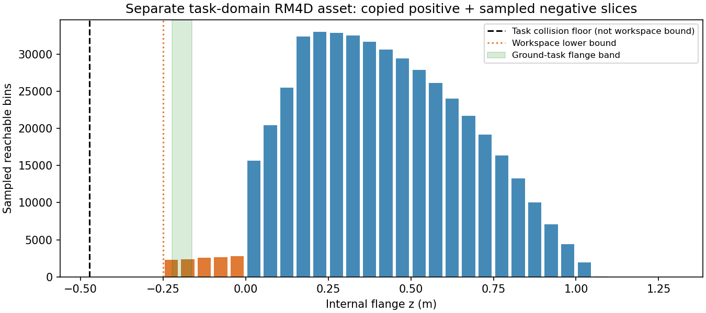
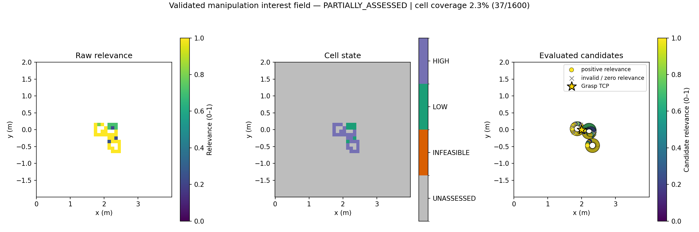

# A5 calibrated task-domain asset

The separately authorized task-floor and negative-z coverage are implemented.
This does not modify RM4D baseline physical definitions, M-R1–M-R4, or A1–A4.
A5 E2E completion is a separate requirement; asset validation alone is not it.

## Geometry and interfaces

The indexed quantity is `wrist_3_link` flange z in the standalone AUBO world.
For a horizontal mount, public map ground transforms to that world as:

`z_floor = z_ground,map - h_BUNKER - h_mount + z_robot,internal = -0.472 m`.

The independent simulator keeps the same robot and its z=0.01 base placement,
and relocates only its collision plane. Both sampler and validator use this
world. Workspace coverage [-0.25,1.3] is distinct from collision floor -0.472.
The current accepted Ground-task flange band is [-0.2226,-0.1626]; its derivation
and limited task assumptions are in the [approved design](superpowers/specs/2026-09-07-a5-task-domain-map-design.md).

- `build_task_map(root, config, map, calibration_json, output_dir, samples=100000, seed=42)` copies positive slices and stores only sampled negative FK support.
- `open_task_rm4d_api(root, config, asset_dir, frame_calibration)` owns the separate calibrated simulator and reuses the unchanged RM4D validator/planner/API.
- A5 `init` optionally accepts `rm4d_task_asset`; the ROS CLI forwards `--rm4d-task-asset`.
- `initial.json` keeps exact `grasp`, bridged map `result`, `frame_calibration`, and `task_domain_result` separately. For this path `baseline_result` is null. The original baseline path remains available and backward compatible.

## Small integration validation

Run directory: [`task-floor-validation-grxkej`](../outputs/a5/task-floor-validation-grxkej).
These are bounded diagnostic checks, not a benchmark or a capability-completeness claim.

| Input | Internal flange z (m) | Inverse / evaluated / valid |
|---|---:|---:|
| Previously measured exact map grasp | -0.190471318 | 144 / 144 / 139 |
| Ground-task lower accepted envelope | -0.2226 | 216 / 216 / 175 |
| Ground-task upper accepted envelope | -0.1626 | 144 / 144 / 139 |
| Positive-z representative | 0.125 | 18000 / 256 / 219 |

All use unchanged solver settings and gates. Lower-band rejection includes 14
IK failures and 27 insufficient joint margins. This remains sampled/validated
support, not a complete capability map. A1's original assessed/unassessed states
are unchanged.

The original 26 positive slices are bit-for-bit equal, with identical interior
forward/inverse queries at five representative heights. Exact floating-point
voxel-boundary queries can select adjacent slices because the frozen integer
index arithmetic now subtracts another origin. No universal boundary-query
equivalence is claimed and no frozen indexing code is altered.

Nominal home geometry has no self/floor collision and retains robot base z=0.01.
The independently placed plane is at -0.472. A deliberately colliding diagnostic
configuration is rejected after 16 IK starts despite residuals around 1e-14.
The public SIM ground-return test passed five landed frames, maximum absolute
map height error 5.48e-7 m; actual landed UAV base height remains about 0.04484 m.

Actual SIM collision-aware IK and RRTConnect succeeded for two current-target
candidates (000004, 000014; 55 and 42 trajectory points), and lower-band
candidate 000004 (55 points). Local query geometry errors are below 3e-16.
These are planning-only checks under the parked base, not executed grasps.
Actual SIM FK for these three joint configurations agrees with exact local TCP
position within 2.6e-11 m. The approximately 1e-6 rotation-matrix difference from
the exact target is the pre-existing query-only regularization; the exact grasp
has not been changed.

Lower-band candidate 000079 failed actual SIM IK. State-validity inspection
found gripper/arm collisions with `ground/base_link`, not the calibrated floor.
The unchanged standalone AUBO baseline model is not a full BUNKER+AG95 collision
model; SIM's full collision-aware planner remains authoritative for execution.
This failure is retained and does not justify disabling any collision checks.

- [Asset geometry / overlap](../outputs/a5/task-floor-validation-grxkej/asset_geometry_check.json)
- [Target sweep, including rejections](../outputs/a5/task-floor-validation-grxkej/target_sweep_summary.json)
- [Retained collision gate](../outputs/a5/task-floor-validation-grxkej/collision_gate_check.json)
- [Current-target SIM planning](../outputs/a5/task-floor-validation-grxkej/current_target/moveit_candidate4.json)
- [Lower-band SIM planning](../outputs/a5/task-floor-validation-grxkej/lower_band/moveit_candidate4.json)
- [Rejected candidate's SIM chassis contacts](../outputs/a5/task-floor-validation-grxkej/lower_band/candidate79_state_validity.json)
- [Actual SIM FK](../outputs/a5/task-floor-validation-grxkej/actual_sim_fk_check.json)

The natural A5 loop has resumed with fresh aerial perception and MID360.
Its latest run completed three observations, two NBV flights and exact Ground
selection/navigation; it stopped at refined approach branch selection, before
grasp/lift. See [actual A5 progress](A5_SIM_ACTIVE_PERCEPTION.md). Acquisition
and manipulation runtime issues remain separate from frame calibration.
