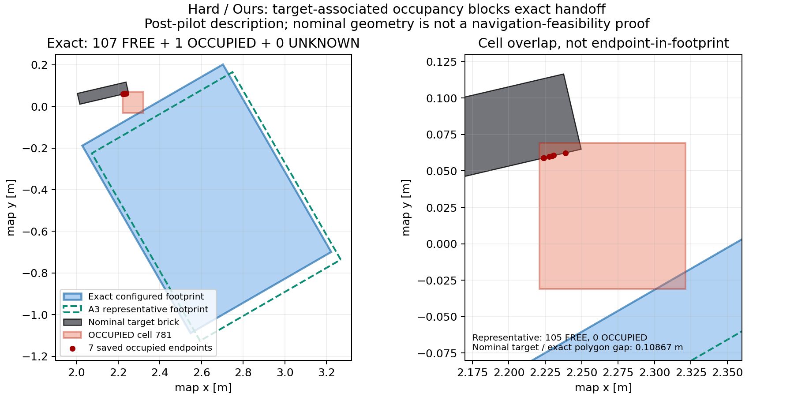

# A6 pilot — review checkpoint, 2026-09-08

**14/14 scheduled slots completed: 14 valid outcomes, plus one retained INVALID
startup activation and its authorized same-slot rerun.** One physical retrieval
succeeded: Easy / Fixed-view. Ours and Generic both failed on all three paired
seeds. This completes pilot execution, not validation of a superiority claim.
No formal matrix, additional method slots or main merge was performed.

Results: [all outcomes, stages, resources and rerun links](../outputs/a6/pilot-20260908/pilot_summary.json),
[same-state scoring](../outputs/a6/pilot-20260908/same_state_scoring.json),
[post-freeze scene descriptions](../outputs/a6/pilot-20260908/scene_description.json).
[The pilot directory](../outputs/a6/pilot-20260908/) retains raw JSON/JSONL, real
MID360 clouds, fields and plots. Runtime/ROS logs remain locally in each activation
directory and are ignored by Git; the decisive startup-error excerpt is also in
its committed attempt JSON.

## 1. Frozen setup and unchanged experiment

All methods/seeds use one map sensing destination **(-1.4, 0, 1.2), yaw=0**, with
common public UAV launch **(-.5, 0, .15), yaw=0**. There is no adaptive or runtime-GT
initialization rule. The observer **4.0 m gate** is unchanged. Entire nominal brick
optical depths: Easy 3.310–3.580 m; Moderate 3.361–3.628 m; Hard 3.480–3.751 m.
All three live RGB-D/hover/raw-ground MID360 checks passed before pilot, with
8.51 / 5.50 / 4.14 m² ground-cell coverage respectively.

The original UAV spawn overlapped Hard wall h1 with a real rotor collision
cylinder. The common launch translation fixes this method-independent setup
defect through existing public arguments; walls/seeds were not moved. See
[initialization qualification and nine separate setup activations](A6_INITIALIZATION.md).
Neither pose choice used RM4D, scores, discovery or outcomes.

[The frozen protocol](A6_PILOT_PROTOCOL.md) defines three total 5-s simulation
windows, one vote/window, own-gain common stopping, exact Ground selection,
failure taxonomy and simulation-time metrics. A1–A5 source, task-domain asset,
thresholds, cost, candidate generator, sensor geometry, seeds, Ground selection
and physical-success definition were not changed or tuned.

Order: slots 1–14 as serialized, then only slot 12's proven INVALID rerun. The two
already queued ablations ran before that rerun; this timing deviation is reported,
not hidden as original-order execution. No valid failure was repeated. There were
15 pilot activations, not 15 independent method slots.

## 2. Every seed × method result

C_env is the final number of exact evidence-confirmed candidates. D_exec requires
actual navigation, fresh refine and executed collision-aware refined pregrasp.
S is physical retrieval. RM4D-only has C_env=N/A, not zero. Unentered downstream
stages are NOT_REACHED, not additional failures.

| Slot | Scene / seed | Method | C_env → D_exec → S | Last successful stage → first failure |
|---:|---|---|---|---|
| 1 | Easy / 2026090801 | Fixed-view | 1 → 1 → 1 | Ground, refine, pregrasp, descend, close, retention and physical lift passed |
| 2 | Easy / 2026090801 | Ours | 0 → 0 → 0 | Three windows → NO_GROUND_HANDOFF |
| 3 | Easy / 2026090801 | RM4D-only | N/A → 0 → 0 | Original top-1 selected → GROUND_NAVIGATION timeout |
| 4 | Easy / 2026090801 | Generic | 2 → 1 → 0 | Ground/refine/refined pregrasp passed → DESCEND joint-speed check |
| 5 | Moderate / 2026090802 | Ours | 4 → 0 → 0 | Ground passed → D435_REFINE timeout |
| 6 | Moderate / 2026090802 | RM4D-only | N/A → 0 → 0 | Ground passed → D435_REFINE timeout |
| 7 | Moderate / 2026090802 | Generic | 4 → 0 → 0 | Ground passed → D435_REFINE height inconsistency |
| 8 | Moderate / 2026090802 | Fixed-view | 0 → 0 → 0 | Three windows → NO_GROUND_HANDOFF |
| 9 | Hard / 2026090803 | RM4D-only | N/A → 0 → 0 | Original top-1 selected → GROUND_NAVIGATION timeout |
| 10 | Hard / 2026090803 | Generic | 0 → 0 → 0 | Three windows → NO_GROUND_HANDOFF |
| 11 | Hard / 2026090803 | Fixed-view | 0 → 0 → 0 | Three windows → NO_GROUND_HANDOFF |
| 12 | Hard / 2026090803 | Ours, valid rerun | 0 → 0 → 0 | Three windows → NO_GROUND_HANDOFF |
| 13 | Hard / 2026090803 | w/o occlusion | 0 → 0 → 0 | Three windows → NO_GROUND_HANDOFF |
| 14 | Hard / 2026090803 | w/o flight cost | 0 → 0 → 0 | Three windows → NO_GROUND_HANDOFF |

Easy Fixed-view's external checker measured brick lift **.148615 m** and TCP
lift **.149759 m** and passed. Controller LIFT alone was not substituted for
physical outcome. Outcome is joined from checker/attempt records; the adapter's
metrics.physical_success=null is not a missing primary result.

Valid failure distribution: **7 NO_GROUND_HANDOFF, 2 GROUND_NAVIGATION,
3 D435_REFINE, 1 DESCEND**. No valid trial failed initial RGB-D, RM4D query or
completed-window acquisition. Slot 4 stopped on max_joint_speed=1.1306,
wrist_3_joint; slot 7 stopped on measured target height -.0429 m versus .0575 m,
with unchanged .0300 m tolerance. No threshold/controller/candidate fallback was
altered to obtain a success.

Secondary descriptive totals: Fixed S=1/3, D_exec=1/3; Generic S=0/3, D_exec=1/3;
Ours and RM4D-only each S=0/3, D_exec=0/3. Evidence discovery: Fixed 1/3,
Generic 2/3, Ours 1/3; N/A for RM4D-only.

## 3. Sole primary comparison: paired Ours versus Generic

| Seed | Ours S | Generic S | Paired outcome |
|---:|---:|---:|---|
| 2026090801 | 0 | 0 | Neither succeeds |
| 2026090802 | 0 | 0 | Neither succeeds |
| 2026090803 | 0 | 0 | Neither succeeds |

Three complete valid pairs: both-success=0, neither=3, **Ours-only b=0,
Generic-only c=0**, paired risk difference (b-c)/3=0. There are **no discordant
pairs** and no common-success resource pairs. First-activation sensitivity
treating the INVALID as failure gives the same three neither-success pairs.
The valid rerun is the primary Hard result; its INVALID is not silently deleted.

No significance, equivalence, power or superiority claim follows from three
pairs. Future approved primary inference remains the preplanned two-sided exact
paired McNemar/binomial analysis of discordants, not an unpaired test or a
selection among the four baselines.

## 4. Observation, discovery and robot resources

Times are **simulation seconds**. T_uav is task start to actual landed, or failure
if earlier; it includes bootstrap/query hovering, not only translation. T_task
includes subsequent Ground/arm work. Recovery landing after failure is separate
in raw cleanup metrics. **≥** marks only observed-segment path sums where TF is
missing; unmarked paths are complete under the frozen sampling/gap rule.

| Slot / method | Windows | NBV commands / rescans | First C_env: window / active s | UAV path m | T_uav | T_active | T_task |
|---|---:|---:|---|---:|---:|---:|---:|
| 1 E Fixed | 3 | 0 / 2 | 3 / 33.872 | ≥6.483 | 86.108 | 33.873 | 174.972 |
| 2 E Ours | 3 | 2 / 0 | not reached | 7.383 | 92.964 | 51.003 | 92.964 |
| 3 E RM4D | 0 | 0 / 0 | N/A | 5.946 | 83.081 | 0 | 203.085 |
| 4 E Generic | 3 | 1 / 1 | 3 / 50.649 | 11.566 | 117.999 | 50.649 | 250.393 |
| 5 M Ours | 3 | 2 / 0 | 3 / 52.821 | 12.588 | 111.960 | 52.822 | 187.184 |
| 6 M RM4D | 0 | 0 / 0 | N/A | 5.180 | 52.007 | 0 | 167.963 |
| 7 M Generic | 3 | 2 / 0 | 3 / 53.138 | ≥12.626 | 114.131 | 53.138 | 170.281 |
| 8 M Fixed | 3 | 0 / 2 | not reached | 5.330 | 77.483 | 38.347 | 77.483 |
| 9 H RM4D | 0 | 0 / 0 | N/A | 4.973 | 52.168 | 0 | 172.173 |
| 10 H Generic | 3 | 2 / 0 | not reached | ≥8.093 | 92.156 | 51.233 | 92.156 |
| 11 H Fixed | 3 | 0 / 2 | not reached | 5.428 | 77.120 | 36.101 | 77.120 |
| 12 H Ours | 3 | 2 / 0 | not reached | ≥7.261 | 92.775 | 51.551 | 92.775 |
| 13 H no occlusion | 3 | 1 / 1 | not reached | ≥5.177 | 93.010 | 52.380 | 93.010 |
| 14 H no cost | 3 | 2 / 0 | not reached | ≥7.437 | 93.770 | 52.092 | 93.770 |

There are 33 completed/voted windows in 33 capture calls. Two disrupted partial
captures were discarded within their original calls (slots 8 and 11, one each);
neither was voted or became an extra trial/window. All MID methods used three
windows and three sensing visits; RM4D-only had one bootstrap visit and zero MID
windows. A nominal stay can require a small corrective FLY_TO after hover drift;
command counts are actual, not inferred from nominal waypoint distance.

All valid runs have usable simulation-time boundaries; no task clock reset was
recorded. Six UAV-total paths are incomplete; all active paths are complete.
Ground flags are separate. Final per-body flags replace the overly conservative
Easy-only interim table annotations; raw results were not changed. No faster
failure or incomplete-path difference is an efficiency advantage. There are no
common-success pairs for a success-conditioned paired resource comparison.

The descriptive success-versus-task-time budget function is explicit: Fixed-view
is 0 below 174.972 simulation seconds and 1/3 at or above that budget; the other
three baselines are 0 at every observed budget. Its successful trial uses three
windows. An exact success-versus-total-distance threshold is unavailable because
that one successful UAV-total path is incomplete; its lower bound is not a
complete-distance threshold.

Ground/arm detail for the seven entered Ground attempts (P/F=pass/fail; all
other slots have these stages NOT_REACHED):

| Slot | Ground path m | Navigation s | D435 refine s | Refined pregrasp s | Descend s | Close / retention / lift s |
|---:|---:|---|---|---|---|---|
| 1 | ≥2.695 | P 64.477 | P 11.503 | P 1.288 | P 4.525 | P 1.516 / .872 / 4.672 |
| 3 | 3.539 | F 120.001 | not reached | not reached | not reached | not reached |
| 4 | ≥3.503 | P 107.814 | P 11.542 | P 6.487 | F 6.543 | not reached |
| 5 | ≥2.562 | P 45.612 | F 29.607 | not reached | not reached | not reached |
| 6 | ≥3.130 | P 86.610 | F 29.341 | not reached | not reached | not reached |
| 7 | ≥2.583 | P 44.475 | F 11.672 | not reached | not reached | not reached |
| 9 | 2.707 | F 120.004 | not reached | not reached | not reached | not reached |

Measured simulation durations need not equal configured wall-clock guards/holds;
those were not changed. RM4D-only's zero active resource does not erase real
initial flight, query, return and landing costs.

## 5. Same-state mechanism and partial coverage

**33/33 snapshots pass** U=u×M_operational, delta_u=(1-exp(-1/2))×u,
both visibility-weighted sums, common flight penalty and reconstructed
tie/order/argmax checks; maximum recorded identity error is 0. **26/33 snapshots
have different Ours/Generic argmax IDs.** Both scores use one saved candidate
set, visibility tensor and costs. This is not an extra trial or a claim of
identical later closed-loop streams. Ablations retain the original common
rankings; variant decisions are explicitly separate.

Live initial grasp/hover/scan/planner variation is retained, not filtered.
Every query had inverse_reachable=144; evaluated=140–144, valid=133–142 and
33–36 assessed A1 cells out of 1600 (2.0625–2.25%). The ceiling remained 256;
every field is PARTIALLY_ASSESSED. Candidate-relative unsupported area never
means globally unreachable A1 UNASSESSED space.

Easy Ours' least-unknown otherwise-clear exact footprint had 103→10→1 UNKNOWN
cells across rounds, versus Fixed 104→5→0 and Generic 103→7→0. This is a
one-cell confirmation boundary, not permission to relax the all-FREE rule.
Moderate Ours/Generic both confirmed four candidates, but refine failures
prevented D_exec and retrieval.

## 6. Hard ablations and a material task-opportunity limitation

| Method | Catalog | Exact footprint has OCCUPIED | Representative blocked | Exact footprint has UNKNOWN | Confirmed |
|---|---:|---:|---:|---:|---:|
| Generic | 35 | 35 | 34 | 35 | 0 |
| Fixed | 35 | 35 | 34 | 35 | 0 |
| Ours | 33 | 33 | 32 | 21 | 0 |
| w/o occlusion | 35 | 35 | 34 | 35 | 0 |
| w/o cost | 34 | 34 | 33 | 22 | 0 |

Columns overlap; none is an additive failure partition. No exact footprint is
clipped. Ours/no-cost each have 12 candidates with no UNKNOWN cells, yet each
still has OCCUPIED evidence. These are **not unknown-only occlusion failures**.

Read-only tracing of all three saved clouds through their actual T_map_sensor
shows that candidate-blocking occupied cells are {778,779,780,781,819,820,821}
(row-major within each grasp-centered grid). Their endpoints are near the target,
z=.0501–.1146 m; the nominal target is .240×.053×.115 m. Across the five runs,
these endpoints lie within .27 mm of its nominal oriented XY rectangle. This
supports target-brick-associated blocking, not spurious floor height or direct
wall/parked-BUNKER overlap at those cells.

Cell 781 intersects every exact candidate. Each run nevertheless has one
unblocked A3 cell-center representative, source 585. For Ours, its exact
candidate-000008 has **107 FREE + 1 OCCUPIED + 0 UNKNOWN cells**; its configured
continuous rectangle contains no saved occupied endpoint and is disjoint from
the nominal target rectangle, but the covered .10 m cell contains target
evidence. No-cost candidate-000007 has the same limitation. Nominal target-
disjoint exact rectangles number 7/7/7/7/6 in the table's order; these checks
are not navigation/manipulation feasibility proofs.

This post-pilot figure uses the saved exact pose, source-585 representative,
cell bounds and seven occupied endpoints in cell 781. The nominal target/exact
polygon gap is .10867 m, not certified runtime collision clearance.
[Vector version](../outputs/a6/pilot-20260908/hard_exact_footprint_cell781.svg).

A2 does not clear accumulated occupied evidence. Consequently **more views
alone cannot confirm these already occupied-blocked fixed exact candidates**,
while the displaced A3 representative can retain positive NBV task utility.
This grid conservatism and representative/exact mismatch is a material confound
for attributing Hard retrieval failure solely to view selection or occlusion.

Both non-repeated ablations have S=0, D_exec=0. No-occlusion took one corrective
NBV command and one rescan; no-cost took two NBV commands. They do not establish
that either component is useful or useless: both encounter the occupied exact-
footprint bottleneck, on one seed each. W/o task weighting is Generic, not a
fifteenth method. No target-mask exception, grid change or method repair was made.

## 7. Scene manipulation checks — descriptions, never exclusions

Checks use saved first-window pose/mount, a level-UAV ground-center visibility
calculation and serialized true wall boxes, not A4 belief prisms as truth.
The patch includes all eligible nominal-clear high-relevance exact footprints;
N=0 is never-observed evidence, not the two-vote UNKNOWN state. Only scene walls
are geometric occluders here. This does not prove Ground routes, continuous
full-footprint visibility, arm clearance or complete physical opportunity.

| Scene / method | True-wall o_task | a_irrel m² | a_task_unknown m² | Ratio |
|---|---:|---:|---:|---:|
| Easy Fixed / Ours / Generic | 0 / 0 / 0 | 6.04 / 5.91 / 5.99 | 1.05 / .95 / 1.03 | 5.75 / 6.22 / 5.82 |
| Moderate Ours / Generic / Fixed | .210 / .230 / .214 | 8.49 / 8.85 / 8.86 | 1.35 / 1.33 / 1.37 | 6.29 / 6.65 / 6.47 |
| Hard Generic / Fixed / Ours | .637 / .635 / .640 | 9.50 / 9.44 / 9.28 | 2.09 / 2.13 / 2.18 | 4.55 / 4.43 / 4.26 |
| Hard no occlusion / no cost | .635 / .637 | 9.19 / 8.90 | 2.15 / 2.17 | 4.27 / 4.10 |

Hard meets proposed wall-occlusion [.60,.85], irrelevant area ≥3 m² and ratio ≥2
in all five snapshots, but that is insufficient for exact operational opportunity
as §6 shows. Moderate falls below [.25,.50] in all three. Easy Generic's measured
first pose/catalog has no fully visible high-relevance exact footprint, unlike
Fixed (4) and Ours (5). These four descriptive discrepancies question robustness
of the labels; no seed, pose or result was rejected, rerun or relabeled for them.
Three RM4D-only runs and the pre-task INVALID have no first MID window.

## 8. INVALID, rerun and engineering corrections

Only pilot INVALID:
[slot 12 / Hard Ours / attempt 01](../outputs/a6/pilot-20260908/slot-12-hard-ours-attempt-01/attempt.json).
The checker saw a TCPROS connection failure during the inherited status
publisher's unregister/re-register window. Adapter exit 2 followed:
“A6 configuration failed: A5 status subscriber did not connect before startup.”
Task-event/trajectory files were empty, with no query, observation or task entry.
The later checker timeout was teardown of an unstarted task, not failed retrieval.

The original wrapper conflated process launch and task start. Its corrected
record retains the original classification, exact fatal/transport messages and
unchanged checker FAIL. A6 now recognizes only this demonstrated startup error,
exit 2 and empty readable events as INVALID. An exit code or missing metric alone
does not erase failure. A bounded 10-s diagnostic-startup connection wait permits
reconnection before task time/actions; A5 code and task/action/capture guards are
unchanged. Independent review passed. The identical Hard/Ours seed completed a
normal task in [attempt 02](../outputs/a6/pilot-20260908/slot-12-hard-ours-attempt-02/attempt.json)
and failed its unchanged three-window handoff rule. No further rerun occurred.

Before pilot: fixed common sensor admission, Hard origin-spawn rotor/wall overlap,
A6 forwarding of existing public launch arguments, and the /use_sim_time
initialization race. Recorder review corrected terminal-before-cleanup timing
and actual refined-stage entry. Offline report tests preserve first-INVALID
sensitivity while a rerun is pending. No frozen research method or new
benchmark/security/evidence framework was introduced.

## 9. Decisions before any formal experiment

This pilot provides **no evidence that Ours improves E2E, D_exec or actual window
count over Generic**. Same-state scores establish a selector difference, not a
retrieval improvement. The important design risks are:

- Target-associated occupied cells can prevent every exact Hard handoff despite
  nominal-clear wall geometry and removal of UNKNOWN. Review task opportunity,
  target/grid semantics and representative/exact correspondence before scaling.
- The one-cell confirmation boundary and Moderate's weaker wall occlusion make
  labels/confirmation sensitive to live sampling. Downstream navigation, refine
  and descend failures can mask observation effects.
- All active methods use three windows: no first-confirmed stop is allowed, and
  stay/rescan can retain positive surrogate gain on FREE cells. Fewer-viewpoint
  claims are not supported under these observed stops.
- Six incomplete UAV-total paths limit efficiency comparisons. Review initial
  recorder TF readiness before formal freeze; do not impute this pilot's gaps.

These are review findings, not retroactive seed exclusions or permission to
change A1–A5, target handling, gates, budget or stopping semantics tonight.
More budget is not an established remedy for the persistent occupied bottleneck.

**Sample size:** three pairs with zero discordants cannot yield a defensible
data-driven formal N or demonstrate equivalence. Do not extrapolate observed
zero discordance into a small powered study. After opportunity/protocol review,
choose a meaningful paired success difference and explicit Ours-only/Generic-only
probability assumptions; calculate exact paired-test power (for example,
two-sided alpha .05 and target power .80) with balanced independent seeds per tier.
These are planning suggestions, not new frozen rules or authority to collect
formal data. Pilot seeds stay separate; cells, windows, candidate yaws and
INVALID reruns are not independent scene samples. Do not launch the formal matrix.

For wall-time capacity planning only, the 14 valid activations consumed 42.325 min
including launch/teardown; the INVALID added .545 min. First activation to final
completion spanned 52.678 min, excluding earlier setup/development. Observed means
were 6.374 min per Ours/Generic seed pair and 12.571 min per four-baseline seed
block. For a future approved N seeds, N times those values is only a rough host
runtime estimate, not robot efficiency or a promised formal budget. Most tasks
failed early; more successful executions, guards, setup and ablations can require
substantially longer. Select formal N from scientific assumptions, not this
machine's overnight throughput.

## 10. Verification and delivery boundary

Post-pilot full regression: **364 tests passed (38.507 s)**. The focused ROS-
boundary group passed 60 tests; complete ROS adapter --check-imports passed.
Offline scoring, scene description and outcome summarization completed.
Independent reviews covered policy, recorder, setup runner, reports, scene
geometry and startup classification. Frozen-file comparison shows no modified
pre-existing A1–A5 source/asset; SIM and frozen RM4D worktrees are clean.
No pilot Gazebo/runtime process remains.

The package retains all 15 activations, 14 valid raw tasks, 33 real clouds and
decision snapshots/plots, checker summaries, raw trajectories, the startup
INVALID and rerun links. Delivery stays on feature/a6-formal-experiments.
Unrelated pre-existing outputs/a5 directories are preserved outside this checkpoint.
Stop at pilot review; no main merge or formal run.
