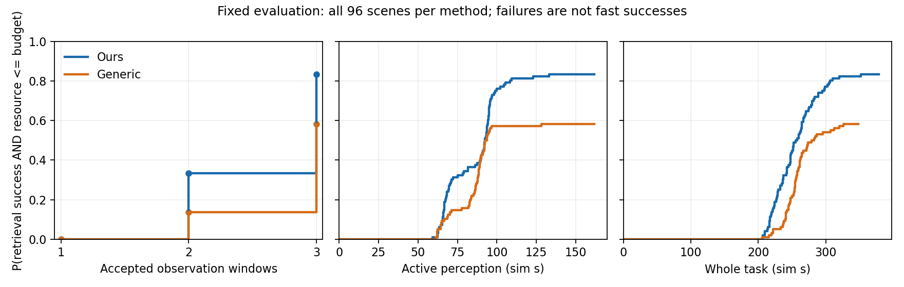

# Paper 1 fixed evaluation — final results

2026-09-11. **All 212 planned tasks completed; no further online evaluation
authorized or started by this report.** This is the independent, prospective
`paper1-eval-finite-scan-v1-final` cohort, not a resumed development/560-slot matrix.

## Result and scope

Under the shared three-window budget, Ours achieved physical retrieval on
**80/96 scenes (83.33%)**, versus **56/96 (58.33%)** for Generic. The prespecified
paired difference is **+25.00 percentage points**, conservative at-least-95%
interval **[+8.56, +39.15] pp**; two-sided exact McNemar **p=0.00000843033**.
This supports a retrieval-success advantage in this specific simulated scene
population. It does **not** establish a time/distance advantage, equivalence,
arbitrary-scene generalization, or real-robot performance.

The population is the prospectively sampled mixture of static horizontal ground,
one known brick, the installed sensors/robots, and zero/one/two low walls with
the specified geometry perturbations. All common execution and platform fixes
belong to both methods. No method, sensor gate, scene, seed, budget, candidate
selection, collision rule or physical success predicate changed during collection.
No operator supplied a successful waypoint, substituted prior perception, or
used Gazebo truth for algorithm decisions. Physics data was used only by the
existing independent success checker and offline diagnosis.

## Complete records and version

| Accounting | Final count |
|---|---:|
| Planned tasks with selected valid binary outcomes | 212/212 |
| Missing/unresolved planned tasks or primary pairs | 0 |
| Primary paired scenes | 96/96 |
| All planned-task successes / failures, including auxiliaries | 141 / 71 |
| Formal activations, including two invalid originals | 214 |
| Proven-invalid replacements | 2/12, one each for slots 131 and 155 |
| Additional external bare Gazebo start, conservatively charged | 1 |
| **All starts / authorized maximum** | **215/224** |

All selected attempts record one identical actual runtime tuple:

- AGENT `3d13a95c3aac8e530aeb9d54f4ab75cc0b37b81a`.
- SIM `a0ae8e32889e92a86f24d2794c7cb143999915fd`.
- Original RM4D baseline `e9d431299053f38a4a4319aed3dfeccc261b9fac`, with the
  independent `assets/rm4d_ground_task_v1` runtime asset.

The [named evaluation version](EVALUATION_VERSION.md) records executable ancestry
`1a6e85b…`; actual collection used the authorized `3d13a95` preparation commit
(cohort/entry/offline-accounting adaptation), not a different robot method.
[Frozen manifest](../configs/paper1_eval.json), [prospective protocol](PAPER1_FORMAL_EXPERIMENT_PLAN.md)
and [launch preparation](PAPER1_EVALUATION_READY.md) remain unchanged.
Three accepted five-simulation-second windows; 12 mm execution clearance;
explicit SIM integrated-pose-interval velocity with native diagnostics;
complete robot/gripper/target/payload checks; normal physical grasp/lift/hold.
The common finite-scan opportunity model, exact-winner support, operational
evidence, costs and execution screen are identical for Generic/Ours. Only their
NBV gain weighting differs. The scene draw is **38 Easy, 28 Moderate, 30 Hard**,
not a post-hoc balanced quota. Method order is the original balanced shuffle.

## Prespecified primary analysis

| Paired physical outcome | Scenes |
|---|---:|
| Both successful (a) | 53 |
| Ours only (b) | 27 |
| Generic only (c) | 3 |
| Neither successful (d) | 13 |

The unit is the paired independent scene, N=96. Δ=(b−c)/96. There is one
aggregate two-sided exact McNemar test, α=.05. The interval is the prespecified
Bonferroni difference of two 97.5% Clopper–Pearson intervals for b/96 and c/96;
it is conservative, not a post-hoc interval selected for significance.

Tier results are descriptive heterogeneity, not three additional primary tests:

| Tier | N | Ours success | Generic success | a / b / c / d | Δ |
|---|---:|---:|---:|---|---:|
| Easy | 38 | 35 (92.11%) | 31 (81.58%) | 29 / 6 / 2 / 1 | +10.53 pp |
| Moderate | 28 | 26 (92.86%) | 22 (78.57%) | 22 / 4 / 0 / 2 | +14.29 pp |
| Hard | 30 | 19 (63.33%) | 3 (10.00%) | 2 / 17 / 1 / 10 | +53.33 pp |

All 96 individual pairs, seeds, slots, terminal reasons, stages and costs are
in [pairs.csv](../outputs/paper1-final-eval-v1/pairs.csv). Generic-only successes
were Easy-004 (Ours perceived target/base collision rejection), Easy-010 (Ours
lost grasp confirmation during lift/retention), and Hard-011 (Ours perceived
target/base collision rejection). These are retained, not retried or excluded.

The prespecified first-activation-invalid-as-failure sensitivity changes only
primary slot 131: **a/b/c/d=52/27/4/13**, Δ=**+23.96 pp**, interval
**[+7.05,+38.72] pp**. The later successful valid replacement is selected in
the primary analysis, not substituted into this sensitivity. All96 denominators
remain intact. Slot155 is auxiliary and does not affect this primary sensitivity.

## Physical progress and first failures

Counts below mean completed stages, not promises based on a plan or heatmap.
Intermediate rejected branches can precede a later successful bounded search;
they are not relabeled as the whole task's first terminal failure.

| Stage completed / criterion reached | Ours /96 | Generic /96 |
|---|---:|---:|
| Aerial-observe stage completed | 94 | 93 |
| At least one confirmed exact candidate | 89 | 63 |
| At least one candidate passed shared execution screen | 88 | 63 |
| Ground navigation / stopping completed | 88 | 63 |
| D435 refine completed | 82 | 59 |
| Actual-arrival D_exec | 82 | 59 |
| Descend completed | 81 | 57 |
| Close completed | 81 | 56 |
| Lift-stage completed | 81 | 56 |
| **Independent physical retrieval / retention success** | **80** | **56** |

Slot165 demonstrates why lift-stage completion alone is insufficient: final
retention failed and the primary outcome remains false. Likewise the screen is
not D_exec, and D_exec is not retrieval. RM4D-only's environmental confirmation
is NOT_APPLICABLE; it is not a failed confirmation.

| First terminal stage (failures only) | Ours | Generic | Auxiliary | Total |
|---|---:|---:|---:|---:|
| Aerial observation / early frame acceptance | 2 | 3 | 3 | 8 |
| Active sensing / hover / budget | 5 | 30 | 9 | 44 |
| Execution screen | 1 | 0 | 0 | 1 |
| Ground refine / observation geometry | 6 | 4 | 0 | 10 |
| Refined pregrasp | 0 | 0 | 1 | 1 |
| Descend / measured approach check | 1 | 2 | 2 | 5 |
| Close | 0 | 1 | 0 | 1 |
| Retention | 1 | 0 | 0 | 1 |
| **Total** | **16** | **40** | **15** | **71** |

Primary budget exhaustion without a confirmed candidate accounts for **5 Ours
and 29 Generic** failures. Other primary failures include four aerial target
timeouts; one fresh-MID360 window timeout with evidence of unsettled hover;
two bounded D435 observation failures; five perceived target/base model
rejections; three other camera/arm/chassis-clearance model rejections; three
measured finger-pad/target approach rejections; one bounded execution-screen
failure; one close-controller abort; and one lost grasp confirmation.
Do not interpret model rejections as proof that solid physical contact occurred.
These are finite-scan, perception, geometry, search or execution limits of the
tested program, not licenses to redraw scenes or weaken checks.

One additional primary failure, **slot207**, is the runtime TF-age acceptance
guard, not established physical infeasibility. The bag shows regular Ground
TF publication near failure, but the adapter did not log its local stamp/age;
negative-age clock/TF receipt race versus stale local buffer remains unresolved.
No broken process/communication contract is demonstrated. It remains VALIDFALSE,
as detailed in [the focused note](../outputs/paper1-final-eval-v1/operator/tf-guard-207.md).
The low-level cause of the slot163 close abort is also unresolved; normal task
execution had begun, so it is not the pre-task startup-invalid case below.
No controller/TF/software changes were made during this cohort.

The common execution layer did not permanently block every scene: 88/63 primary
tasks reached Ground and 80/56 completed retrieval. Remaining stage failures
are disclosed; this is not a claim that all implementation defects or all
possible structural deadlocks have been excluded.

## Windows, actual location changes and simulation time

Across all96 tasks, Ours accepted 0/2/3 windows on **2/34/60** tasks; Generic on
**3/15/78**. Zero-window failures remain failures. No primary task completed
retrieval in one window. Observed-location change means >0.20m XYZ or >0.20rad
yaw between the first accepted packet poses of consecutive windows, not commanded
goals or traveled distance. All primary location classifications are available;
Ours had 0/1/2 changes on **2/75/19** tasks, Generic on **3/75/18**. No resolved
yaw-only changes occurred. Nonzero-offset command counts differ (Ours 2/76/18,
Generic 3/77/16 at 0/1/2), so the two notions are not conflated.

Conditional efficiency uses only the **53 jointly successful scenes (55.21%)**.
The following intervals are descriptive 10,000 whole-scene paired bootstrap
intervals, fixed seed2026091024; no secondary significance claims or censoring
of fast failures. All53 paired metrics here are present.

| Metric | Ours mean | Generic mean | Mean paired O−G | Descriptive 95% interval |
|---|---:|---:|---:|---|
| Accepted windows | 2.491 | 2.774 | −0.283 | [−0.415, −0.150] |
| Resolved location changes | 1.057 | 1.151 | −0.094 | [−0.208, +0.019] |
| Active perception, sim s | 81.515 | 84.268 | −2.752 | [−7.873, +2.805] |
| Ground execution, sim s | 106.858 | 108.376 | −1.518 | [−7.875, +5.133] |
| Whole task, sim s | 249.843 | 257.867 | −8.025 | [−17.004, +1.242] |

Paired median differences are respectively 0,0,+0.769s,−1.950s,−9.242s;
their bootstrap intervals and both methods' marginal medians are retained in
the JSON exports. Fewer accepted windows on jointly successful scenes is
supported descriptively; **time saving and fewer actual relocations are not
established**. Success rates are not equivalent: the prespecified ±5pp precision
band is not met. Do not convert non-significant time differences into equality.

For the full denominator, `P(retrieval AND windows≤2)` is **32/96 vs13/96**,
and by three windows **80/96 vs56/96**. The full-N time/resource curves below
retain every failure as no retrieval, not as a fast event. Timing-missing-success
bounds coincide in these data because successful tasks have the needed times.

Missing/not-applicable intervals stay null: across212 selected tasks, active
time is null in7 pre-active failures and Ground time in53 no-handoff tasks.
All primary task times and window counts are present; all actual packet-pose
location-change classifications are available. Fixed's six nonzero-offset
command counts are unavailable and remain null, not zero. Complete UAV-total
distance is recorded for only **7/96 Ours and33/96 Generic**; full paths are
often incomplete. **No flight/Ground distance-saving claim**, no lower-bound
substitution, no energy estimate. Some RM4D-only active records are structurally
zero because it bypasses this phase, not evidence of equal sensing capability.

## Auxiliary controls and ablations (descriptive only)

The original scheduled Ours outcomes are reused on each prospectively selected
subset; there were no new favorable counterpart runs.

| Comparator | N | Ours / comparator retrieval | a / b / c / d |
|---|---:|---|---|
| Fixed-view | 6 | 5 / 1 | 1 / 4 / 0 / 1 |
| RM4D-only | 6 | 5 / 2 | 2 / 3 / 0 / 1 |
| Ours without flight cost | 4 Hard | 2 / 2 | 2 / 0 / 0 / 2 |
| Ours without occlusion reasoning | 4 Hard | 2 / 0 | 0 / 2 / 0 / 2 |

Context scenes: Easy001/002, Moderate001/002, Hard001/002. The ablation scenes
are Hard001–004. No-cost succeeds on Hard002/004 like Ours; no-occlusion
succeeds on none. These tiny subsets cannot establish equivalence, universal
necessity of occlusion, or general utility/non-utility of flight cost. Generic
already supplies the primary w/o-task-weighting comparison; there is no duplicate
ablation treated as extra evidence.

## Mechanism records and shared scoring

The offline exports cover **541 saved round states** from selected tasks.
All541 shared gain/cost/argmax and opportunity identities pass (maximum recorded
numerical identity error0);514 states have different Ours/Generic best IDs.
This is a check of the two policies on the **same saved state**, not541 independent
trials or a claim that divergent closed-loop runs received identical observations.
Ablation files retain full-method diagnostic scores separately from their actual
policy decisions; they are not mistakenly treated as full-method actions.

All541 operational summaries are available. They retain TARGET / ENVIRONMENT /
AMBIGUOUS votes, actual ground presence, raw-grid versus continuous operational
blocking, exact-winner anchors and confirmation. No representative-only blocking
disagreement occurs in these saved exact assessments.350 snapshots contain at
least one target-associated grid-aliased but operationally retained exact candidate;
retention is not confirmation or physical success. Non-winner candidates remain
in frozen evaluated-candidate records for diagnostics, never used for support
reselection; this report does not claim a fresh exhaustive non-winner replay.
Prediction remains a finite-scan opportunity surrogate, not guaranteed hits or
a calibrated probability. Hard failures are not repaired by invented ground votes.

## Invalids, interventions, retention and resources

- **Original131:** USB data-disk disconnect/write errors interrupted required
  terminal evidence. Its partial raw data and damaged progress line remain;
  the documented invalid original has no invented binary result. One authorized
  same-slot replacement passed physical retrieval.
- **Original155:** SIM required startup node exited after AG95 homing path error
  before usable task execution. Auto INVALID remained unchanged. Its one
  replacement started normally but failed aerial target observation: **VALIDFALSE**,
  not replaced again. No homing/controller tolerance was changed.
- **External bare Gazebo after132:** desktop crash-notifier process launched
  an unrelated default-port simulator. The verified process group was stopped.
  No formal control/data contamination was established; slot132 stays valid.
  It consumes one extra start, but is neither a method task nor an invalid reserve
  replacement. See the operator incident notes and [activations.csv](../outputs/paper1-final-eval-v1/activations.csv).

There was operator-level startup cleanup, continuation and incident diagnosis,
but **no human intervention in any selected task's observation, candidate or
robot execution decisions**. No valid task was retried. Original failures and
all historical development results remain. The one damaged resource-progress
line is disclosed; it does not create a missing selected primary outcome.

First formal entry: **2026-09-11 02:00:52.355 Asia/Shanghai**
(epoch1789063252.3554409). Last attempt and post-pair retention completed about
**20.30 elapsed hours** later. Deadline remains **2026-09-16 02:00:52.355**;
the24–36h estimate was never a resettable allowance. No task was truncated or
sample count reduced for time/space.

Across1910 stored resource samples, peak accounted new occupancy was
**280.95GiB**, minimum data-disk free space **335.94GiB**. After compression,
the report snapshot is approximately **276.75GiB** new and **340.15GiB** free;
conservative whole-disk free-space drop is **279.55GiB** including unassigned
host/filesystem changes. These are sampled extrema and explicit accounting,
not a continuous global-usage guarantee. The500GiB/100GiB limits retain ample
margin. See [resource-summary.json](../outputs/paper1-final-eval-v1/resource-summary.json).

All214 attempts have retention notes. Native CSV was losslessly gzip-compressed
where available (the incomplete131 raw files were preserved as found).
Under the predeclared successful-image policy, **129 temporary full RGB-D bags**
(308,276,637,429 original bytes) were removed **after** physical/stage/missingness
review and four actual color/depth frame exports per bag. Those full image
sequences are **not recoverable** from the exports. Failures, invalids, designated
retention scenes, other available raw sensing/diagnostics and historical results
were not deleted. This is documented per attempt in retention.json and the
[retention index](../outputs/paper1-final-eval-v1/retention-index.json).

## Deliverables and verification

- [Frozen full analysis](../outputs/paper1-final-eval-v1/analysis-latest.json):
  primary inference, all96 pairs, auxiliary pairs, sensitivity, time/window curves,
  selected outcomes and original invalid records.
- [212 task rows](../outputs/paper1-final-eval-v1/slots.csv),
  [96 primary pairs](../outputs/paper1-final-eval-v1/pairs.csv),
  [214 activation records](../outputs/paper1-final-eval-v1/activations.csv).
- [Descriptive summaries](../outputs/paper1-final-eval-v1/descriptive-summary.json),
  [operational mechanism rows](../outputs/paper1-final-eval-v1/mechanism-rounds.csv),
  [same-state scores](../outputs/paper1-final-eval-v1/same-state-scoring.csv),
  [vector curves](../outputs/paper1-final-eval-v1/resource-curves.svg).
- [Offline export recipe](../outputs/paper1-final-eval-v1/operator/export-final-tables.py)
  and [plot recipe](../outputs/paper1-final-eval-v1/operator/plot-final-curves.py).
  They add no robot behavior and were created only after collection.

Fresh verification:44 frozen evaluation/entry/setup/statistical tests and70
relevant entry/finite-scan/operational-scoring tests passed. Independent read-only
review reproduced the primary test/interval from raw outcomes, confirmed all212
physical statuses, actual versions/order/replacement scope, and obtained a fresh
reduction identical to the stored analysis. No additional Gazebo regression or
formal slot was launched. See the package README for reproduction and local-data
limits. Results/checkpoint may be pushed; **no PR or branch is merged into main**.

The justified paper claim is improved physical retrieval probability under the
shared finite observation budget in this defined simulated population, with
descriptively fewer accepted windows on joint successes. Time saving, relocation
saving, distance saving and real-world transfer remain unproven. Shared platform
improvements are prerequisites, not exclusive contributions. Next work is
manuscript analysis/writing using these fixed results, not outcome-driven tuning
or expansion of this test set.
