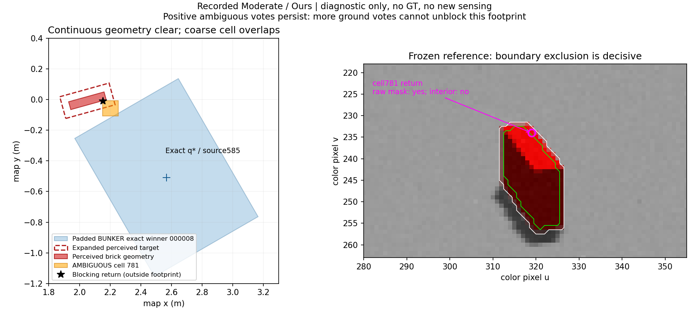

# v1.2 fresh validation — scientific stop at 3/6

2026-09-09. **Not formal-ready.** The first two Easy trials succeeded; the
third, Moderate/Ours, exposed a persistent AMBIGUOUS-cell handoff deadlock.
Following the approved stop condition, slots4–6 were not started. This is a
research-review checkpoint, not completion of the six-slot validation.
No method, threshold, seed, budget, selection or success criterion was changed.
PR#6 remains Draft; no formal matrix or historical slot17 was started.

## Prospective freeze and setup

[Protocol](V12_FRESH_VALIDATION_PROTOCOL.md) and
[configuration](../configs/a6_v12_validation.json) were committed/pushed in
`4a405e8` before any setup or method activation. The three first eligible draws
exclude all126 historical pilot/formal reservations; zero redraws. All six
slots were fixed together, independently of scores, candidate counts and outcomes.

| Tier | Fresh seed | Frozen order | Setup ground cells | Window (simulation s) |
| --- | ---: | --- | ---: | ---: |
| Easy | 1249652395 | Generic, Ours | 838 | 5.029 |
| Moderate | 405111274 | Ours, Generic | 612 | 5.022 |
| Hard | 1450983937 | Generic, Ours | 405 | 5.033 |

All three first setup activations passed the existing RGB-D, TF/hover and
MID360 check, including the unchanged minimum100 ground cells. Initial view
`(-1.4,0,1.2,0)`, launch `(-.5,0,.15,0)`,4m observer gate and all common settings
were retained. Setup does not query RM4D or evaluate method gain.
Seeds and scene rules remain unchanged after the stop; no replacement scene.

## Literal outcomes and stages

All three method activations are **VALID_TRIAL**. There were zero invalid
activations, retries or runtime patches after method execution began.
`NR` means not run, not failure. Each running method used explicit
`support_anchor=exact_winner` and the shared v1.1 operational gate.

| Slot | Tier / method | Raw blocked → operational blocked, by window | Confirmed, by window | D_exec | Retrieval |
| ---: | --- | --- | --- | --- | --- |
| 1 | Easy / Generic | 30→30;30→30;30→30, of34 | 0→0→4 | yes | success |
| 2 | Easy / Ours | 30→30;30→30;30→30, of34 | 0→0→3 | yes | success |
| 3 | Moderate / Ours | 34→34, of34 | 0 | no | failure: active / NO_PREDICTED_TASK_GAIN |
| 4 | Moderate / Generic | NR | NR | NR | NR |
| 5 | Hard / Generic | NR | NR | NR | NR |
| 6 | Hard / Ours | NR | NR | NR | NR |

Easy selected the original per-cell winner `candidate-000006/source625` in both
independent trials. Generic exact map XY=(2.495715846,-.432678402), Ours
(2.501712379,-.413683335); yaw=2.268928028. Both had109/109 measured ground-support
cells. The different measured poses arise from independent runtime perception,
not a changed candidate rule. Both completed BUNKER navigation, fresh D435
refine, collision-aware refined pregrasp, descend, grasp, lift and retention.
Independent checkers returned `CHECKS_PASS`, checker/adapter exit0, with physical
brick lifts0.148231578m and0.148670252m respectively. Runtime exits were0.

Moderate failed in `active`, before Ground selection. Ground navigation/refine,
pregrasp, grasp and lift are `NOT_REACHED`, not execution failures. Its subsequent
cleanup landing is separate from task-efficiency accounting. The original
failure classification is retained in `attempt.json` and `metrics.json`; the
structural diagnosis below is additional explanation, not reclassification.

Only **one complete pair** exists: Easy both-success. Discordant pairs=0 among
that one complete pair; Moderate is incomplete, not a Generic success or failure.
No efficacy/significance, power or sample-size inference is supported.

## Simulation-clock resources

| Trial | Windows / NBV moves | First confirmation window / active s | Active UAV m / s | Total UAV m / s | Task s |
| --- | --- | --- | --- | --- | ---: |
| Easy Generic | 3 / 2 | 3 / 50.005 | 3.412 / 50.007 | 11.001 / 111.560 | 164.367 |
| Easy Ours | 3 / 2 | 3 / 48.474 | 3.409 / 48.474 | 10.735 / 108.368 | 160.483 |
| Moderate Ours | 1 / 0 | none | .330 / 9.179 | 4.375 / 53.181 | 53.181 |

All reported UAV paths are complete under the existing sample-gap rule. Active
motion includes observed hover/controller motion;0 NBV moves does not imply
zero path length. Total UAV time ends at landing or task failure, as frozen;
cleanup is separate. Ground total path is unavailable for Easy Generic
(6 missing samples) and Easy Ours(1 gap); retained lower bounds are2.161m and
2.248m, not substituted as complete distances. Ground navigation durations are
24.279s and24.875s; D435 refine14.268s and14.054s. Full stage counts, paths,
missingness, task/first-discovery/D_exec times are in the linked JSON/CSV tables.
Failure-shortened runs are not interpreted as efficiency gains.

## Association, exact support and same-state scores

Final occupied classes, expressed as `cells / cumulative window-votes`:

| Trial | TARGET | ENVIRONMENT | AMBIGUOUS | TARGET-alias retained candidates |
| --- | --- | --- | --- | ---: |
| Easy Generic | 5 / 12 | 7 / 19 | 6 / 16 | 0 |
| Easy Ours | 5 / 10 | 6 / 18 | 6 / 16 | 0 |
| Moderate Ours | 6 / 6 | 33 / 33 | 7 / 7 | 0 |

Class cells and blocking causes overlap; these are not exclusive partitions.
All target references were AVAILABLE. Per-window classes, votes, poses and
candidate IDs are preserved. The frozen sensor/pixel allowance formula was
unchanged; this scene's computed geometric allowance is0.0469209411m, not a
new configured threshold.

All **7 saved snapshots** reproduce exact winner identities, evaluation indices,
poses, relevance, operational semantics, assessments and all12 A3 arrays.
No extra cell-center veto occurs. Winner-blocked/non-winner-clear diagnostic
cells/alternatives are3/5 in each Generic Easy window,2/5 in each Ours Easy
window, and0/0 for Moderate. They never change selection. In Moderate,
multi-support reselection would not remove the observed ambiguous-cell blocker.

All7 same-state gain/cost/argmax checks pass. Five snapshots have different
stored task/generic best IDs, including Moderate's absent task best. These are
same-state numerical diagnostics, not unexecuted method outcomes. For example:

- Easy Generic window1: task best26(score37.248), generic best9(score486.749).
- Easy Ours window1: task best26(score38.403), generic best9(score492.678).
- Moderate window1: every task gain=0; Generic best1 has gain374.648 and
  score373.941. Positive Generic gain does **not** establish a Generic retrieval
  result, nor remove the frozen operational blocker in this saved state.

Both score calculations use each snapshot's single ordered candidates,
visibility tensor and flight cost. Independent closed-loop trials are not
claimed to share identical measured states or later candidate coordinates.

## Structural diagnosis: a persistent mask-boundary cell

This diagnosis uses only recorded RGB-D/MID360, public TF, perceived target
geometry and frozen functions. No Gazebo ground truth enters it.

Moderate has34 validated per-cell winners.29 intersect the expanded perceived
target and must remain blocked. The other5 are continuously separated from
that target, with no ENVIRONMENT or clipping blocker. Nevertheless all five
include AMBIGUOUS cell781; the last also includes780. They currently lack real
ground support and are **not** claimed confirmed, executable or collision-free
against unknown surroundings.

| Exact winner / source | Ambiguous cells | Minimum blocking-point distance to padded base (m) | Positive SAT separation from expanded target (m) |
| --- | --- | ---: | ---: |
| 000008 / 585 | 781 | .118215 | .058366 |
| 000009 / 705 | 781 | .098215 | .038366 |
| 000010 / 584 | 781 | .091850 | .042739 |
| 000035 / 623 | 781 | .106091 | .030493 |
| 000067 / 622 | 780,781 | .071850 | .022739 |

SAT values are separating-axis projection gaps, not exact rectangle distances.
This concerns the34 budget-limited A1 winners, not a complete capability map.



The left panel shows exact winner000008, the padded base and perceived target;
the occupied cell overlaps the base although its actual return is separated.
In the right panel, white is the original red mask and green its frozen
one-pixel-eroded interior. No contour is expanded to grant association.

Cell781 has just **one** occupied AMBIGUOUS endpoint: original MID360 row58439,
map=(2.1533774393,-.0105388525,.1141005983). Its cell bounds are
x=[2.1518471839,2.2518471839], y=[-.1079343777,-.0079343777]. Projection is
color pixel(u,v)=(319,234): raw red mask=true, eroded interior=false.
Registered depth3.6350593567m versus projected3.6639060027m gives residual
0.0288466460m, within the existing pointwise allowance of0.0467023158m. Thus its
decisive rejection is the **intentional boundary rule**, not missing depth or
an excessive residual. See [association code](../src/operational_gating/association.py)
and the existing boundary test in [test_target_association.py](../tests/test_target_association.py).

Across the ROI there are8127 ENVIRONMENT,109 AMBIGUOUS and62 TARGET occupied
endpoints. Most other ambiguous endpoints have sparse registered-depth holes,
but that is not the cause for shared cell781. The classification is not changed
to TARGET merely because the point is near the known manipuland.

For any cell b, frozen accumulation and blocking imply

\[
A_{N+k}(b)\ge A_N(b)>0
\quad\Longrightarrow\quad
\operatorname{blocked}(q)=1\quad\text{if }b\in F(q).
\]

The history and initial RGB-D reference are retained, so replay labels the old
point AMBIGUOUS again. Extra ground/TARGET votes cannot subtract the old vote.
An in-memory diagnostic appending two **hypothetical** ideal ground windows
made all five footprints ground-supported, but all remained blocked; ambiguous
votes were unchanged. These were not physical observations or trial results.
Consequently M_operational and U_task remain0, and Ours terminates before
further sensing can resolve the issue. This is not a3-window budget shortage.
See [accumulation/blocking](../src/operational_gating/core.py) and
[fixed-reference reassociation](../src/operational_gating/io.py).

### Runtime/registration checks

Replaying the exact SIM perception implementation at clean platform5e25039
reproduced mask, converted depth, registered depth and surface-pixel indices
identically. T_color_depth and surface-point differences were only
2.08e-16 and8.88e-16m; transform-composition residual2.22e-16. RGB-D skew=.003s,
age=.384s. MID360 had52 monotone chunks56.531–61.621,88763 summed points, and
the final chunk TF matched the saved anchor. These checks establish recorded
numerical consistency, not an independent proof of physical calibration.
No runtime/TF/registration defect was demonstrated; the boundary classification
is explicitly covered by the frozen unit test.

## Verification, files and research decision

Minimal engineering change before all runs: two-line optional launcher forwarding
of the already-supported exact-anchor flag; old configs preserve their defaults.
The new read-only diagnostic reports do not feed the method. No SIM, RM4D,
asset, A1–A5/v1.2 research-source or numerical parameter change was made.

- Full core:562 tests,22 environment-dependent skips, no failures.
- Native Noetic split:93 passed; actual task-map/RM4D:9 passed.
- Reporter:6 focused tests passed; independent spec and quality reviews passed.
- All7 exact-support and same-state scoring replays passed.
- Independent structural review agrees: stop for research, not runtime repair.
  Suites overlap and are not summed as independent evidence.
- All current validation launchers/runtime children exited; dedicated11951/11952
  ports are released. The host also has a separate default-port11345 Gazebo
  process naming an old pilot log, with ownership unconfirmed; it was left
  untouched, not treated as a fresh trial or used as a method input.

Result package:

- [Six-slot outcome/paired summary](../outputs/a6/v12-fresh-validation/reports/summary.json)
- [Detailed tables JSON](../outputs/a6/v12-fresh-validation/reports/tables.json),
  [CSV](../outputs/a6/v12-fresh-validation/reports/tables.csv)
- [Per-window operational mechanism](../outputs/a6/v12-fresh-validation/reports/mechanism.json)
- [Exact anchors and diagnostic-only non-winners](../outputs/a6/v12-fresh-validation/reports/exact-support.json)
- [Same-state score identities](../outputs/a6/v12-fresh-validation/reports/scoring.json)
- [Raw attempts/setup, NPZ observations, references and per-window nbv.png](../outputs/a6/v12-fresh-validation)

Public diagnostic bags and ROS/adapter/checker logs remain local under existing
ignore rules; raw observations, references, decisions and summaries are in Git.
Pilot-1/Pilot-2 and the16 interrupted v1.1 formal results are unchanged and not
pooled with this validation. The earlier accepted natural A5 regression remains
integration evidence, not an extra fresh paired sample.

Offline reproduction of the saved-state checks, writing only new temporary
reports (does not run SIM, a method, or another observation):

```bash
v12_review=$(mktemp -d)
v12_core=/media/lu/P450_PAPER/RM4D_AUBO/conda-env/bin/python
PYTHONPATH=src "$v12_core" scripts/a6_exact_support_diagnostics.py \
  --results-dir outputs/a6/v12-fresh-validation --output "$v12_review/exact.json"
PYTHONPATH=src "$v12_core" scripts/a6_scoring_diagnostics.py \
  --results-dir outputs/a6/v12-fresh-validation --output "$v12_review/scoring.json"
PYTHONPATH=src "$v12_core" scripts/a6_operational_diagnostics.py \
  --results-dir outputs/a6/v12-fresh-validation --output "$v12_review/mechanism.json"
/usr/bin/python3 scripts/summarize_a6_pilot.py \
  --config configs/a6_v12_validation.json --results-dir outputs/a6/v12-fresh-validation \
  --output "$v12_review/summary.json"
```

**Decision needed:** whether to authorize design of a minimal revision for
resolving/spatially representing genuinely unresolved occupied evidence without
an irrevocable whole-cell handoff blocker. Do not silently accept mask-boundary
points, clear A2 evidence, relax thresholds, substitute non-winners or merely
increase sensing. No such revision is implemented here. Formal readiness and
comparative efficacy remain unestablished; slots4–6 and all formal runs remain
stopped pending research review.
